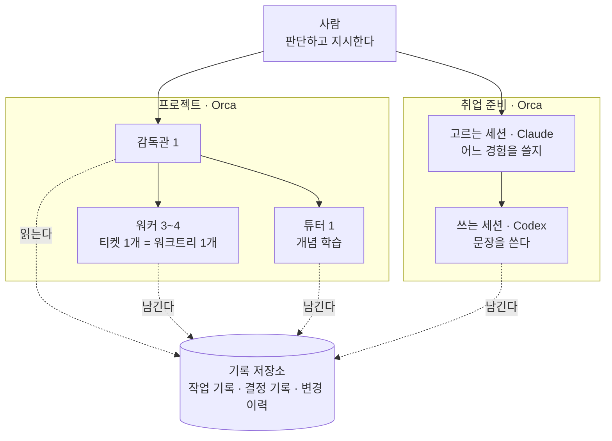

# 에이전트 하네스 — 일은 맡기고, 판단은 남겼다

**AI 코딩 에이전트에게 구현과 문서와 기록을 맡기면서, 무엇을 맡기고 무엇을 사람이 쥘지를 정해 둔 운영 방식**

2026.07– · 개인 · PinLog에서 시작해 FINCH와 취업 준비까지

<a href="pinlog.md"><picture><source media="(prefers-color-scheme: dark)" srcset="https://img.shields.io/badge/PinLog_기록-4C6CB3?style=for-the-badge"></picture></a> <a href="finch.md"><picture><source media="(prefers-color-scheme: dark)" srcset="https://img.shields.io/badge/FINCH_기록-4C6CB3?style=for-the-badge"></picture></a>

> [!NOTE]
> **30초 요약.** 에이전트는 구현·커밋·초안 작성까지 합니다. 무엇을 할지, 팀에 무엇을 보낼지, 어떤 경험을 지원서에 쓸지는 제가 정합니다. 경계는 에이전트의 실력이 아니라 **되돌릴 수 있는가**로 그었습니다. 사람이 판단을 쥐고 있으니 사람이 병목이고, 화면이 실제로 어떻게 보이는지는 저 한 사람만 봅니다. 그 한계까지 아래에 적었습니다.

---

## 어떤 상황이었나

PinLog는 5주짜리 6인 팀 프로젝트였고 프론트엔드 기능 구현은 사실상 저 혼자였습니다. 5주 안에 혼자 다 칠 수 있는 양이 아니어서 구현의 상당 부분을 에이전트에게 맡겼습니다. 이어진 FINCH(5인, 6주)에서는 프론트엔드 구현 전반을 같은 방식으로 맡았고, 프로젝트가 끝난 뒤에는 지원서 쓰는 일에도 같은 에이전트를 썼습니다.

맡기면서 세 가지가 문제였습니다.

- **에이전트는 세션이 끝나면 다 잊습니다.** 규칙도 결정도 어디까지 했는지도, 파일에 적혀 있지 않으면 다음 세션에 없습니다.
- **에이전트가 팀원에게 직접 닿을 수 있었습니다.** MR·이슈·Jira는 팀에 알림이 가는 글입니다. 제가 모르는 문장이 제 이름으로 나가면 팀원의 질문에 답할 수 없습니다.
- **만드는 속도가 제 이해 속도를 넘었습니다.** 워커가 하루 열두 건을 처리하는 날이 있었고, 보고에는 제가 모르는 개념이 계속 나왔습니다.

---

## 지금 지키는 규칙 다섯

바뀐 것이 많은 중에 이 다섯은 유지되고 있습니다. 앞으로도 고칠 수 있는 규칙이고, 고정된 원칙은 아닙니다.

| 규칙 | 뜻 |
|---|---|
| 판단은 사람이 한다 | 무엇을 할지, 어떤 티켓을 열지, 팀에 무엇을 보낼지, 규칙을 고칠지는 에이전트가 정하지 않습니다 |
| 경계는 되돌릴 수 있는지로 긋는다 | 커밋·브랜치 푸시는 에이전트가 합니다. MR·이슈·티켓처럼 **팀원에게 알림이 가는 쓰기**는 제 승인 뒤로 뺍니다 |
| 워커 하나 = 워크트리 하나 = 브랜치 하나 | 고칠 파일이 겹치는 일은 나누지 않고 순서대로 돌립니다. 자기 워크트리 밖 파일이 필요하면 감독관에게 요청하고, 감독관이 조율한 뒤에만 건드립니다. 머지가 끝나면 워크트리를 지웁니다 |
| 개인 실행 방식은 팀 저장소에 커밋하지 않는다 | 감독관 프로토콜·워커 계약·모델 배정은 커밋되지 않는 로컬 파일에 둡니다. 팀 공유 지침과 섞지 않습니다 |
| 기록은 따로 남긴다 | 워커는 티켓마다 막힌 것·시도한 것·배운 것을 개인 기록 저장소에 새 파일로 남깁니다. 다음 세션이 먼저 읽는 자산이고, 워커는 그곳을 읽지는 못합니다 |

---

## 한눈에 보는 구조

실선은 지시가 내려가는 방향, 점선은 기록이 쌓이는 방향입니다.

| 자리 | 누가 | 하는 일 |
|---|---|---|
| 사람 | 저 | 무엇을 할지, 무엇을 밖에 낼지, 규칙을 고칠지 |
| 감독관 | 에이전트 1 | 티켓을 태스크로 쪼개고 워커에 배정. 승인 관문. 이슈·MR 상태 |
| 워커 | 에이전트 3~4 | 구현. 커밋하고 브랜치를 올리는 데까지. **MR은 만들지 않고 본문 초안만 파일로 남긴다** |
| 튜터 | 에이전트 1 | 제가 모르는 개념. 산출물은 팀 저장소가 아니라 학습 노트에 쌓인다 |
| 고르는 세션 · 쓰는 세션 | Claude · Codex | 지원서. 고르는 쪽은 어느 경험을 쓸지 번호만 정하고, 쓰는 쪽이 기록 파일을 직접 열어 씁니다 |

워커를 3~4개로 둔 기준은 토큰 한도와 제 검토 속도입니다. 워크트리 수는 워커와 일대일이라 따로 세지 않았습니다.

### 도구와 모델은 하는 일에 따라 나눴다

| 일 | 도구 | 이유 |
|---|---|---|
| 기획 | 채팅 | 파일을 건드리지 않고 가볍게 검색하며 빠르게 정리할 수 있고, 기기를 옮겨도 같은 세션이 이어집니다 |
| 구현 · 지원서 | Orca | 감독관 하나에 워커 여럿을 붙이는 구조가 그대로 됩니다. Claude와 Codex를 한 화면에서 오가고, 워커마다 작업을 클릭으로 오갈 수 있습니다. 휴대폰으로도 열려 점심시간에 걸어 둔 작업에 추가 지시를 하거나 권한을 허용하거나 보고를 읽었습니다 |
| Claude만 쓰는 작업 | Claude 데스크톱 앱 | 화면과 조작이 편합니다 |

| 역할 | 모델 | 비고 |
|---|---|---|
| 감독관, 고르는 세션, 난제 워커 | Claude(Opus 계열) | 판단 재료를 정리하거나 어려운 구현을 맡는 자리 |
| 일반 구현 워커 | Claude(Sonnet 계열) · Codex | 범위가 정해진 구현 |
| 쓰는 세션 | Codex | 같은 재료로 쓴 글을 제가 나란히 비교했을 때 Codex 쪽이 더 나았습니다. 주관적 비교이고 측정값은 없습니다 |
| 기업 조사 | Gemini | 검색에 쓰려고 계획했고 아직 적용하지 않았습니다 |

---

## 세 버전으로 바뀌어 왔다

| | v1 · PinLog | v2 · FINCH | v3 · 취업 준비 |
|---|---|---|---|
| 시기 | 2026.07–08 · 6인 팀 | 2026.08–09 · 5인 팀 | 2026.08– · 개인 |
| 핵심 | 에이전트가 지킬 **규칙과 관문을 문서로 먼저** 적었다 | 감독관·워커·튜터 **세 계층**으로 나누고, 경계를 **되돌릴 수 있는지**로 그었다 | 에이전트가 쓸 수 있는 **재료를 검증된 기록으로 한정**했다 |
| 앞에서 바뀐 것 | 묻고 답을 붙이던 방식에서, 규칙 문서 · 병렬 작업 공간 · 감독 창구 하나로 | 학습 세션을 따로 뺐다. MR 같은 외부 발신을 승인 뒤로 뺐다. 개인 실행 방식을 팀 저장소 밖으로 옮겼다 | 고르는 세션과 쓰는 세션을 나누고 모델을 다르게 썼다. 판단이 든 변경은 결정 기록으로 따로 둔다 |
| 드러난 한계 | 권한을 실행 주체와 무관하게 고정해 둬서, 모델을 낮추자 지시 밖 수정이 머지·배포됐다 | 화면이 실제로 어떻게 보이는지는 저 한 사람만 판단한다 | 같은 규칙이 여러 문서에 있을 때 개수는 세지만 내용은 대조하지 못한다 |

### 단계마다 걸린 문제가 다음 구조를 만들었다

| 단계 | 한 일 | 그래서 걸린 것 |
|---|---|---|
| 0 | 하나씩 묻고 답을 그대로 붙였다 | 코드가 왜 도는지 모른 채 결과만 쌓였다 |
| 1 | 저장소 전체를 맡기고 스스로 고치게 했다 | 엉뚱한 것을 덧붙여도 알아채지 못했다. 순차라 느렸다 |
| 2 | 작업 공간을 나눠 여러 대를 동시에 돌렸다 | 충돌은 줄었지만 제 응답을 기다리는 일이 반복됐고, 같은 기능이 두 번 구현됐다 |
| 3 | 감독 역할을 세워 창구를 하나로 모았다 | **병목은 AI가 아니라 저였습니다.** 대신 감독이 기억할 문맥이 너무 길어졌다 |
| 4 | 학습 세션을 따로 뺐다 | 감독은 작업만, 학습은 개념만 다루게 됐다 |

---

## v1 PinLog에서는 규칙을 먼저 적었다

> 2026.07–08 · [프로젝트 기록](pinlog.md)

| 층위 | 역할 |
|---|---|
| 도메인 사실 | 추측 대신 근거로 삼는 원본 기획·명세 |
| 금지 규칙 [`AGENTS.md`](https://github.com/Team-PinLog/front/blob/dev/AGENTS.md) | 실제 실패를 규칙으로 고정 (6항목) |
| 작업 절차 [`conventions.md`](https://github.com/Team-PinLog/front/blob/dev/docs/conventions.md) | 티켓 → 브랜치 → **커밋 전 보고** → PR → 머지 |
| 자동 검증 | lint · typecheck · build · test 통과해야 이미지 빌드 |
| 재발 방지 [`troubleshooting/`](https://github.com/Team-PinLog/front/blob/dev/docs/troubleshooting/README.md) | 다음 세션이 먼저 읽는 실패 기록 |

규칙은 실패한 뒤에 붙었습니다. "프론트는 토큰을 저장하지 않는다"를 에이전트가 "재발급 로직을 만들지 말라"로 읽어 401 복구가 통째로 빠진 뒤, 금지 옆에 허용되는 인접 행위를 같이 적는 형식으로 바꿨습니다. 같은 오독은 다시 나오지 않았습니다.

권한을 상수로 둔 것이 이 시기의 실수였습니다. 일정이 급해지며 조율 세션의 권한을 넓혔는데, 토큰이 부족해 모델을 낮추자 지시하지 않은 범위까지 수정된 채로 머지·배포됐습니다. 결함은 약한 모델이 아니라 **권한이 실행 주체와 무관하게 고정돼 있었다는 점**이었고, 이후로는 권한을 실행 주체에 종속된 값으로 다룹니다.

---

## v2 FINCH에서는 계층을 셋으로 나눴다

> 2026.08–09 · [프로젝트 기록](finch.md)

감독관·워커·튜터 세 계층은 위 「한눈에 보는 구조」와 같습니다. 이 시기에 정한 것은 경계입니다.

| 에이전트에 맡긴 것 | 제 승인 뒤로 뺀 것 |
|---|---|
| 구현, 커밋, 브랜치 푸시 | MR 생성 |
| 워크트리 생성과 정리 | 이슈·위키·Jira에 쓰는 것 전부 |
| 기록 파일을 새로 쓰는 것 | 팀에 보이는 글의 **문구** — 취지만 승인받고 문구를 지어 올리지 않는다 |
| 문서 초안 | 이슈와 MR을 닫는 것 |

브랜치 푸시는 되돌릴 수 있지만 팀원에게 간 알림은 되돌릴 수 없습니다. 워커가 승인 없이 팀에 보이는 글을 올린 일이 두 번 있었고, 그 뒤로 워커는 MR을 만들지 않고 본문 초안만 파일로 남기게 했습니다. 왜 그렇게 고쳤는지는 작업한 워커만 알기 때문입니다.

### 사고가 날 때마다 규칙이 한 줄씩 붙었다

| 규칙 | 계기 |
|---|---|
| **워커는 MR을 만들지 않는다** | 승인 없이 팀에 보이는 글이 두 번 올라갔다 |
| **워커는 의존성을 설치하지 않는다** | 의존성 폴더가 워크트리 사이에 링크로 공유돼, 한 워커의 설치가 다른 워커를 말없이 깨뜨린다 |
| **새 티켓을 파기 전에 미머지 브랜치를 훑는다** | 이미 다른 브랜치에서 더 낫게 풀린 문제를 티켓까지 끊어 다시 풀었다 |
| **한 워크트리에 에이전트는 하나** | 워크트리 하나에 터미널이 셋 살아 있었고, 지시가 죽은 터미널로 갔다 |
| **워커의 질문은 주기적으로 확인한다** | 워커 둘이 질문을 던지고 20분·30분을 기다리다 실패로 끝났다 |
| **기기를 옮기면 락파일이 바뀌었는지 먼저 본다** | 402커밋 뒤처진 기기에서 설치를 건너뛰어 워커가 모듈을 못 찾고 멈췄다 |

규칙 문장은 에이전트가 썼고, 무엇을 규칙으로 올릴지는 제가 정했습니다. 계약 전체와 세션 시작·인수인계·기기 이동 절차는 다음 프로젝트에 옮겨 쓸 수 있게 템플릿으로 두었고, 템플릿 저장소는 비공개입니다.

---

## v3 취업 준비에서는 에이전트가 쓸 재료를 좁혔다

> 2026.08– · 개인

경험을 하나씩 따로 기록하고, 기록마다 근거와 검증 상태를 붙이고, 에이전트는 그 기록만 재료로 쓰게 했습니다. 기록에 없는 경험은 "없다"고 답합니다.

| 필드 | 뜻 |
|---|---|
| 근거 | 커밋·PR 해시나 저장소 경로 |
| 검증 | 근거와 본문을 대조했는가 |
| 내 것인가 | "제가 했습니다"라고 말할 수 있는가. 에이전트가 설계하고 제가 검토한 것은 아니라고 표시 |
| 주의 | 밖에서 쓰면 안 되는 표현. 예: "커밋 수를 성과로 쓰지 않는다" |

형식을 다 채워도 쓸 수 없는 기록이 있었습니다. 워커 산출물 일곱 건을 후보로 올렸다가 제가 그 내용을 처음 들어서 전부 반려했고, **자료를 다시 읽지 않고 꼬리질문에 답할 수 있어야 재료**라는 관문을 하나 더 뒀습니다. 판정은 제가 합니다.

지시서가 길어지자 에이전트가 절차를 목록이 아니라 평문으로 읽고, 맨 앞의 확인 단계나 검증 단계를 건너뛰는 일이 생겼습니다. 하루 사이에 네 번이었습니다. 그래서 커맨드 문서 맨 위에 절차를 한 줄씩 옮긴 체크리스트를 두고, 시작할 때 그대로 옮겨 하나씩 지우게 했습니다. 시간이 없어 단계를 건너뛰어야 할 때도 에이전트가 줄이지 않고 "이 단계는 넘어갈까요?"라고 묻습니다. 건너뛸지는 제가 정합니다.

기록은 두 층입니다. 그날의 결정과 막힌 것은 검증 전이어도 바로 적는 층에, 지원서 재료는 근거가 붙어야만 들어가는 층에 둡니다. 둘 사이의 통로는 하나뿐이어서, 아래 층의 기록을 지원서에 바로 인용하지 않습니다.

워커가 남기는 기록은 이런 모양입니다 (한 건 발췌)

> **문제.** 모바일에서 종목 상세를 열면 헤더·현재가·보유 카드·탭 목록이 전부 고정이라 그 묶음이 화면 높이의 절반 가까이를 차지했다. 보유 카드와 탭 목록을 스크롤 안으로 내리고, 탭 목록은 스크롤 영역 위에 붙여 두는 것이 목표였다.
>
> **시도 — sticky의 top은 마진 박스 기준이다.** 탭 목록 위 여백 18px을 `mt-4.5`로 주고 `sticky top-0`을 걸면 테두리 박스가 18px 아래에 선다. 붙은 막대 위에 투명한 틈이 남고 그 틈으로 탭 내용이 지나간다. 이 레포에는 같은 사고가 이미 한 번 있었다. 선택지는 둘이었다. 여백을 그대로 두고 `-top-4.5`로 상쇄하거나, 여백을 margin 대신 padding으로 주거나. 2번을 골랐다. 1번은 값 둘이 서로를 상쇄하는 구조라 나중에 여백만 고치면 깨진다.

기록마다 사람이 준 지시와 피드백 원문이 맨 위에 그대로 붙습니다. 워커가 요약하면 제 판단이 사라지고 워커의 해석만 남기 때문입니다.

---

## 이 구조의 한계

- **화면이 실제로 어떻게 보이는지는 저 한 사람만 봅니다.** 에이전트는 화면을 띄울 수 없습니다. 자동 검사를 전부 통과한 코드가 화면에서는 장애 안내처럼 읽힌 일이 있었고, 그런 결함은 전부 이 자리에서 잡혔습니다. 제가 꼼꼼해서가 아니라 구조가 그 단계를 한 사람에게 남겨 뒀기 때문입니다.
- **판단을 사람에게 모았으니 사람이 병목입니다.** 워커 수를 3~4개로 둔 기준 하나가 제 검토 속도입니다.
- **제약을 많이 쓸수록 결과가 서로 닮아 갔습니다.** 디자인 시안 셋을 경쟁시키며 걸어 둔 제약이 세 방향을 수렴시켜, 고르라고 만든 선택지가 고를 것이 없는 선택지가 됐습니다.
- **같은 규칙이 여러 문서에 있을 때, 개수는 세지만 내용은 대조하지 못합니다.** 내용 대조는 사람이 합니다.
- **지금 구성이 최선이라고 말할 근거는 없습니다.** 나눠야 했던 이유가 증상으로 남아 있을 뿐이고, 문맥 길이나 대기 시간을 재 두지 않아 "효율이 올랐다"고도 말할 수 없습니다.

---

## 기여의 범위

| 제가 결정한 것 | 에이전트가 만든 것 |
|---|---|
| 판단하는 자리는 사람이 맡고 위임하지 않는다 | 규칙·지침 문서의 문장 |
| 증상이 나올 때마다 계층을 나눈다 | 각 워커의 구현 코드 |
| 경계를 "되돌릴 수 있는가"로 긋는다 | 동기화·상태 조회·세션 기록 스크립트 |
| 경험을 검증된 기록으로 저장하고 에이전트가 그것만 재료로 쓰게 한다 | 결정 기록과 변경 이력의 본문 |
| 설명하지 못하는 기록은 쓰지 않는다 | 조직도 제안 |
| 무엇을 규칙으로 올릴지, 무엇을 기각할지 | 계약 조항 초안 |

---

## 숫자

| | 2026-09-30 기준 |
|---|---|
| 경험 기록 | 74 (그중 "내 것 아님" 23, 검증 완료 56) |
| 결정 기록 | 45 |
| 변경 이력 | 388 |
| 일일 기록 | 146 |
| 자동화 명령 | 6 |
| 자동화 스크립트 | 개인 저장소 15 · 팀 저장소 6 |
| 세션 훅 | 2 |

규모이지 성과가 아닙니다. 기록이 많다는 것은 기록을 했다는 뜻이지 기록이 맞다는 뜻이 아닙니다.

---

## 도구

 

[Orca](https://www.onorca.dev/)는 Claude Code·Codex 같은 CLI 에이전트를 워크트리마다 하나씩 병렬로 돌리는 오픈소스 에이전트 개발 환경입니다. 감독관·워커 구조와 기기 이동은 이 도구 위에서 돌아갑니다.
