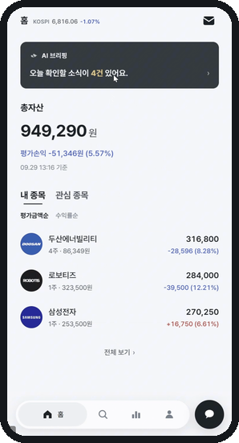
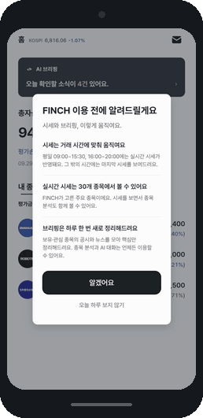
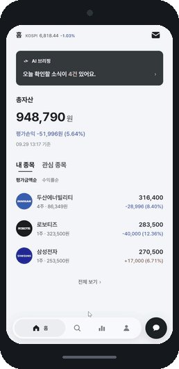
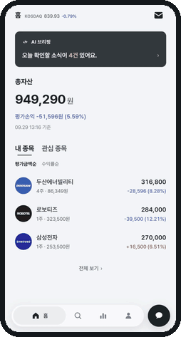
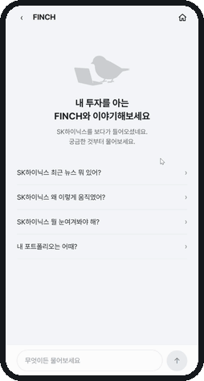
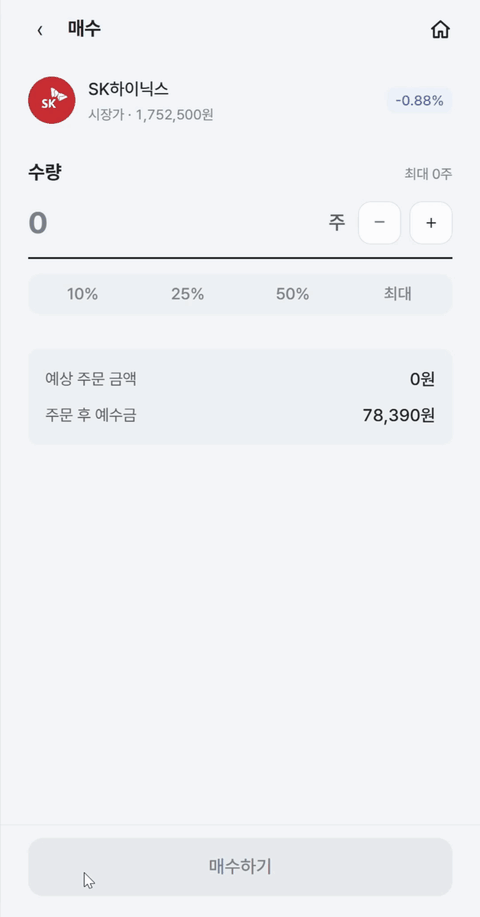
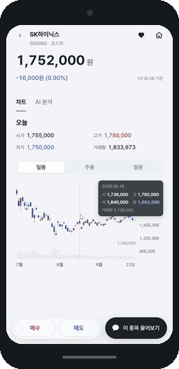
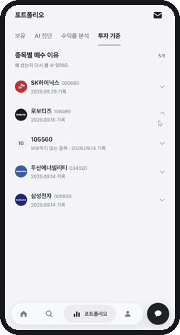
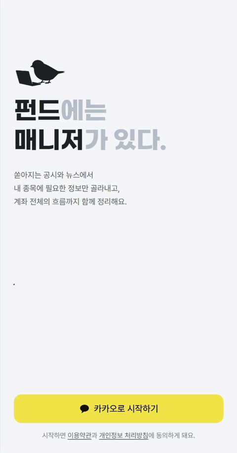
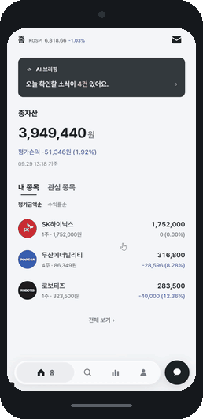

# FINCH — 묻는 판을 만들고, 기다리는 시간을 문서로 메웠다

> 내 계좌와 성향을 읽고 투자 판단을 돕는 AI 비서가 있는 증권 앱
> 2026.08.19 – 09.28 · 5인 팀 · 프론트엔드 구현 전반 담당

  

**시연 영상** [전체 흐름](https://youtu.be/NeSLU96e15I) · **서비스** [FINCH](https://finchapp.org) · **저장소** [Team-FINCH/finch-frontend](https://github.com/Team-FINCH/finch-frontend) · **팀** [Team-FINCH](https://github.com/Team-FINCH)

---

## 담당 범위

종목 상세와 AI 채팅을 비롯해 프론트엔드 구현 전반을 맡았습니다. 백엔드·AI 파트와 주고받는 API 계약을 프론트 쪽에서 관리하고, 실제 서버 대신 응답을 돌려주는 목 서버도 작업 범위에 포함했습니다.

| 영역 | 맡은 범위 |
|---|---|
| 화면 | 종목 상세 · 홈 · AI 채팅 · 예수금 · 주문 · 거래내역 · 문의함 |
| 기능 | 백엔드가 중계하는 시세의 화면 단위 구독·해제, 기간별 캔들 차트, 수량 기반 시장가 매수·매도 |
| 협업 기반 | API 계약 문서 관리 · 목 서버(MSW) · 프론트 규약 |

프론트엔드 영역 커밋 692건 중 510건(74%), master에 머지된 작업 브랜치 204건 중 156건(76%)을 담당했습니다. 다른 프론트엔드 팀원은 포트폴리오·인증 화면과 디자인 문서를 맡았습니다. 아래 사례에는 에이전트가 제안하거나 구현한 부분도 있습니다. 그때 제가 한 일은 무엇을 요청하고 어떤 안을 받아들일지 정하는 것이었습니다.

### 화면

모바일 웹 세로 화면입니다. 전체 흐름은 [시연 영상](https://youtu.be/NeSLU96e15I)에 있습니다.

| **홈** | **종목 상세** | **AI 분석** |
| :---: | :---: | :---: |
|  지수와 총자산, 보유 종목, 그날의 AI 브리핑 |  실시간 시세와 일봉·주봉·월봉 캔들 차트 |  최근 변화 · 주목 요인 · 위험 · 다가오는 일정 |
| **AI 채팅** | **주문 — 잔고가 모자랄 때** | **매수** |
|  보던 종목을 물고 들어갑니다. 대기 표시 뒤 답이 한 글자씩 나오고 근거 출처가 따라옵니다 |  부족한 금액과 충전 경로를 같은 자리에서 안내합니다 |  수량과 예상 금액, 주문 전후 비중 비교, 체결 뒤 보유 반영 |
| **매매 내역** | | |
|  매수 · 매도 · 입금 · 출금 유형별 필터 | | |

아래 두 화면은 **다른 프론트엔드 팀원이 구현했습니다.** 서비스 전체 흐름을 보이기 위해 함께 싣습니다.

| **로그인** | **포트폴리오** | |
| :---: | :---: | :---: |
|  서비스 소개 문구가 순환합니다 |  보유 · AI 진단 · 수익률 분석 · 투자 기준 네 탭 | |

---

## 질문을 보냈는데, 무엇이 남았는지 몰랐다

프론트엔드에서 다른 파트에 물어볼 일이 생기면 팀 채팅에 상대를 태그했습니다. 대화가 쌓이면 질문도 밀렸습니다. 답이 오지 않은 것인지, 제가 답을 놓친 것인지 알려면 이전 대화를 다시 읽어야 했습니다. API 계약을 확정할 시점이 다가오는데 **무엇이 미결인지 한눈에 볼 곳이 없었습니다.**

새 도구를 들이지 않기로 하고, 팀이 이미 쓰는 셋 안에서 자리를 찾았습니다. 팀 채팅에 전용 채널을 하나 더 파는 안은 이미 채널이 많아 하나 더 늘리는 부담이 컸습니다. Jira에는 스프린트 티켓이 있었고, 티켓은 우리가 할 일이지만 문의는 남이 답할 일이라 추적 단위가 달랐습니다. 팀 위키는 팀장이 파트별로 페이지를 나눠 본문 수정과 코멘트로 주고받자고 제안한 안이었는데, 문의가 쌓이면 하위 페이지를 아무리 나눠도 비대해질 것 같았습니다. 찾아보니 위키는 팀 안에서 잘 변하지 않는 규칙을 두는 자리였습니다.

**이슈 보드는 팀원이 제안했습니다.** 저는 처음에 이슈가 작업 단위로 나누는 것 아닌가 싶었는데, 작업 단위는 이미 Jira 티켓이 맡고 있으니 GitLab 이슈는 문의와 요청 전용으로 써도 되겠다고 보고 그 안을 받았습니다. 결정적인 것은 본문 체크박스 목록에 진행률이 자동으로 붙어 **`6 of 12`가 목록 화면에서 보인다**는 점이었습니다. 무엇이 미결인지 한눈에 볼 곳이 없다는 문제가 여기서 풀립니다.

도구보다 어려운 것은 쓰게 만드는 일이었습니다. 처음에는 마일스톤과 복잡한 라벨 규칙까지 넣었다가 지웠습니다. 받는 사람에게 남긴 일은 **이슈를 열고, 번호에 맞춰 댓글로 답하고, 체크박스를 누르는 것**이었습니다. 라벨은 보내는 쪽에서 붙이게 했습니다.

질문 문장도 다시 썼습니다. 짧게 줄이면 좋을 줄 알았는데, 같은 용어를 파트마다 다르게 이해해 되묻는 일이 생겼습니다. "구독"이 이 프로젝트에서 최소 세 층으로 쓰이고 있었습니다. 그래서 여러 뜻으로 쓰이는 말은 **무엇을 묻는 것이 아닌지**까지 함께 적어 나머지 뜻을 배제했습니다. 프론트의 가정을 먼저 적고 맞는지 확인받는 형식도 상대가 정할 것을 통보하는 모양이 됐습니다. 그래서 선택지를 적고 해당 파트가 고르게 바꿨습니다.

템플릿도 한 번 뒤집혔습니다. AI 도구를 적극적으로 쓰지 않는 팀원에게서 **템플릿을 채우기가 어렵고 본문이 길어 읽기 힘들다**는 피드백을 받았습니다. 도구가 읽기 좋은 형식을 사람이 읽는 형식보다 앞에 둔 것이 문제였습니다. 사람이 그대로 읽고 바로 답할 수 있는 길이로 다시 썼습니다.

### 팀 전원이 썼다

이슈 보드는 채택됐고 다른 파트도 문의를 올렸습니다. 팀원들이 체화한 뒤로는 MR에서 관련 이슈를 태그하는 것까지 자리를 잡았습니다. 아래는 2026년 8월 21일부터 9월 24일까지의 기록입니다. 이 이슈들은 저장소를 GitHub으로 옮길 때 파트별 저장소로 함께 넘어와 지금도 `GitLab 이슈` 라벨로 열 수 있습니다.

| 확인한 것 | 결과 |
|---|---|
| 사람이 작성한 이슈 | 105건, 봇 작성 1건 제외 |
| 작성에 참여한 사람 | 팀 전원 |
| 다른 팀원들이 올린 이슈 | 43건 |
| 제가 올린 이슈에 다른 사람이 답한 경우 | 62건 중 48건 |

제가 질문을 모아 놓는 데서 끝나지 않고, 다른 파트도 같은 곳에 문의를 남기고 답하는 자리가 됐습니다.

**이 판단의 한계.** 세 번 뒤집힌 것은 전부 같은 종류의 실수였습니다. 기능적으로 옳은 것을 먼저 만들고 받는 사람 입장을 나중에 생각했습니다. 다음에는 상대가 무엇을 읽고 어떻게 답해야 하는지를 세 줄로 먼저 적고, 거기서 벗어나는 기능은 넣지 않겠습니다. 운영에서도 한계를 알고 시작했습니다. 체크박스는 누가 눌렀는지 남지 않고, 두 사람이 비슷한 시각에 누르면 나중 저장이 앞 것을 덮어씁니다. 여러 항목을 묶은 이슈는 부분 완료가 목록에서 보이지 않습니다. 건별로 쪼개면 이슈가 열일곱 개가 되어 받는 쪽에 더 부담이라, 묶은 채로 시작하고 실제로 덮어쓰기가 나면 그때 쪼개기로 했습니다. 되돌리는 비용이 작은 쪽을 먼저 골랐습니다.

---

## 확정된 것과 가정한 것을 문서로 갈라 두고 먼저 만들었다

AI 채팅 화면에서 답을 생성하는 동안 다른 화면으로 이동하면, 생성 비용은 나가는데 답은 사용자에게 닿지 않는 문제가 있었습니다. 요청을 계속 열어 두는 방식에서 작업을 접수한 뒤 결과를 받는 방식으로 바뀌었지만, 백엔드와 주고받을 계약은 아직 전부 정해지지 않았습니다.

저는 잠정적인 계약으로 먼저 진행하기로 정했습니다. **확정된 내용과 가정한 내용을 문서에서 구분하고, 가정이 틀렸을 때 고칠 범위를 같이 남기는 방식**입니다. 이 계약 문서는 프론트 쪽에서 제가 관리했고, 문장을 쓰고 갱신하는 작업은 에이전트가 맡았습니다.

에이전트는 서버 응답을 화면에서 쓰는 형태로 바꾸는 어댑터에 가정을 모으자고 제안했습니다. 나중에 답이 왔을 때 그곳을 고치면 되도록 하자는 뜻이었습니다. 되돌릴 범위를 먼저 알 수 있다는 이유로 받아들였습니다. 문서에는 그 기준을 **"되돌리는 비용이 보이지 않으면 잠정으로 정하지 않는다"**로 적었습니다. 고칠 곳을 지목할 수 없는 항목은 아예 가정하지 않고 회신을 기다렸다는 뜻입니다.

가정으로 만든 뒤에는 그 가정을 이슈로도 보냈습니다. 어떤 값으로 구현해 두었는지와 문서의 미확정 번호를 적고, 실제와 다르면 알려 달라, 그 값으로 바꾸겠다고 썼습니다. 답을 기다리느라 멈추지는 않되 상대가 정정할 자리는 남겨 두는 방식입니다.

실제로 가정은 틀렸습니다. 작업 번호가 따로 오는 줄 알았는데, 확정된 응답은 공통 형식 안에 작업 번호를 담고 있었습니다. **이 건에서는 어댑터와 목 서버를 고쳤고, 화면 코드는 바뀌지 않았습니다.**

대신 문서를 계속 따라 고쳐야 했습니다. 이후 에이전트에게 계약을 다시 대조하게 하자, 이미 구현이나 회신이 왔는데도 문서에는 미확정으로 남은 항목이 드러났습니다. 먼저 개발할 수 있게 해 준 문서가 구현보다 뒤처져 있었습니다.

**이 판단의 한계.** 화면 코드가 바뀌지 않은 것은 이 한 건의 결과입니다. 가정이 늘 맞았다거나 늘 싸게 고쳐졌다는 뜻이 아닙니다. 그리고 적어 두고 먼저 가는 방식은 문서를 따라 고쳐야 값을 하는데, 그 갱신이 구현보다 뒤처지면 다음 작업에 낡은 가정을 넘깁니다. 구현이나 회신을 반영할 때 미확정 표시도 함께 확인하는 일을 작업에 넣겠습니다.

---

## 401만 보고 사용자를 로그아웃시키면 안 됐다

프론트의 인증 인터셉터는 모든 응답을 가로채, 토큰이 만료됐으면 재발급하고 원요청을 다시 보냅니다. 흔한 구현은 **HTTP 상태가 401이면 세션 문제로 본다**입니다. 401을 내는 곳이 우리 서비스뿐이라면 맞는 말입니다.

그런데 팀 API 명세가 **AI 서버가 낸 오류의 코드와 상태를 백엔드가 그대로 통과시키도록** 정하고 있었습니다. 이 규칙 자체는 옳습니다. 재시도해도 소용없는 오류와 재시도하면 되는 오류를 백엔드가 전부 502로 뭉개면 프론트가 둘을 구분할 수 없습니다. 문제는 통과에 예외가 없다는 점이었습니다. 백엔드와 AI 서버 사이에도 자체 인증이 있어서, 그 내부 토큰이 어긋나면 AI 서버가 낸 401이 규칙대로 화면까지 내려옵니다. 상태 숫자로 분기하면 **사용자는 AI 분석을 한 번 눌렀다가 멀쩡한 세션을 잃습니다.**

이 문제를 먼저 지적한 것은 백엔드였습니다. 그 지적을 확인하려고 AI 파트 명세를 열었더니, 401의 발생 조건이 "내부 토큰 불일치"인데 프론트 처리 칸에는 **"재로그인"**이라고 적혀 있었습니다. 우려하던 시나리오가 다른 파트의 명세에 문장으로 이미 박혀 있었습니다.

처음 나온 안은 AI 요청을 공통 처리에서 빼는 것이었습니다. 제가 낸 안이었고 제가 기각했습니다. AI 요청에도 공통 헤더와 오류 응답 처리는 필요해서 같은 코드를 두 벌 두게 되고, 예외로 뺄 경로 목록은 앞으로 늘어납니다. **목록을 갱신하는 것을 잊으면 방어가 조용히 뚫립니다.**

**대신 방어의 방향을 뒤집었습니다.** 인터셉터는 하나로 두고, 위험한 것을 걸러내는 대신 **안전한 것만 통과시키는 기준**으로 바꿨습니다. 사용자 인증 오류로 합의한 코드 셋일 때만 세션을 건드리고, 그 밖의 응답은 세션에 손대지 않고 호출한 화면에 넘깁니다.

차이는 모르는 것이 들어왔을 때 드러납니다. "401이면 세션 처리"는 모르는 401이 오는 순간 사고가 나지만, "아는 코드일 때만 세션 처리"는 모르는 코드가 와도 아무 일이 일어나지 않습니다. 코드 필드가 아예 없는 응답도 매칭이 실패해서 자동으로 안전해집니다. 위험한 것의 목록은 낡으면 조용히 뚫리지만, **안전한 것의 목록은 우리 것이라 우리가 통제합니다.**

이 기준을 정한 것은 인터셉터 구현 전이었고, 실제 구현은 다른 프론트엔드 팀원이 맡았습니다.

**이 판단의 한계.** 성립 조건이 하나 있습니다. 우리가 고른 코드 이름이 우리 서비스의 사용자 인증에서만 나와야 합니다. 명세가 AI 오류 코드를 그대로 통과시키므로 AI 파트가 같은 이름을 나중에 추가하면 조용히 깨집니다. 그래서 이름공간 합의를 이슈로 요청했고, 백엔드 공통 목록과 AI 명세 양쪽에 이미 같은 이름이 하나 있다는 것을 겹침이 실제로 가능하다는 증거로 함께 적었습니다.

---

## 시세를 가져오는 방식을 화면 밖에 두기로 했다

종목 화면과 홈, 주문 화면은 일정 주기마다 서버에 시세를 다시 묻고 있었습니다. 팀 계약에는 화면이 시세를 구독하고 해제하는 동작만 알도록 하자는 요구가 있었습니다. 나중에 값을 받는 방식이 바뀌어도 화면까지 고치지 않으려는 경계였습니다.

계약과 코드를 대조하도록 에이전트에게 요청했더니, 그 경계가 문서에만 있고 코드에는 없다는 보고가 왔습니다. 세 화면이 각자 조회 훅을 직접 부르고, 화면은 그 훅이 내는 상태 필드를 그대로 읽고 있었습니다. 이 상태에서 전송 방식을 바꾸면 훅 셋으로 끝나지 않고 **화면까지 번집니다.** 계약이 막으려던 것이 정확히 그것이었습니다. 발견한 자리에서 고치지 않고 별도 작업으로 열기로 정했습니다.

에이전트가 제안한 안은 **화면에서는 시세를 구독하거나 해제하고, 주기적으로 서버에 묻는 처리는 그 안쪽에서 맡는 구조**였습니다. 화면이 뜨면 구독이고 화면을 떠나면 해지이며, 그 안쪽이 폴링인지 아닌지는 화면이 모릅니다. 그 뜻을 검토해 승인했습니다. 구조의 세부 설계와 구현은 에이전트가 했습니다. 프론트 규약이 기능 폴더끼리 서로 가져다 쓰는 것을 막고 있어 자리는 공용 계층이 됐고, 세 화면이 그것 하나만 씁니다.

실제 데이터 수신은 폴링입니다. 팀 계약이 폴링을 최종 구조의 폴백 경로로 정해 두었고, 웹소켓 전환은 시연 범위에서 빠졌습니다.

**이 판단의 한계.** 그래서 전송 방식을 실제로 바꿨을 때 화면이 그대로인지는 **확인되지 않았습니다.** 지금 있는 것은 "바꿔도 화면이 안 바뀌게 해 두었다"는 구조이고, 그것이 맞았는지는 증명되지 않았습니다. 경계를 어디에 두고 무엇을 돌려줄지도 에이전트가 낸 안이고 제가 한 것은 티켓을 열기로 정하고 그 안을 승인한 것까지입니다.

---

## 어긋난 것을 고치기 전에, 왜 어긋났는지부터 물었다

AI 채팅에서 근거 목록이 답변 본문보다 길어지는 문제를 처리하면서, 상위 한 건만 펼치고 나머지는 접기로 정했습니다. 구현을 지시한 뒤 **그 결정이 팀의 화면 설계 문서와 부딪힌다**는 보고를 에이전트에게서 받았습니다. 문서에는 근거 표시를 "접어두거나 생략하지 않는다"고 적혀 있었습니다.

할 수 있는 선택이 셋이었습니다. 문서에 맞춰 결정을 되돌리거나, 문서를 조용히 고치거나, 어긋난 채로 두고 진행하는 것입니다.

셋 다 택하지 않고 **그 문장이 왜 그렇게 적혔는지 앞뒤 맥락을 물었습니다.** 문서가 왜 그런지 모르는 상태에서는 되돌리는 것도 고치는 것도 근거가 없습니다. 같이 적은 이유는 하나였습니다. **문서와 구현이 다르면 나중에 또 회귀합니다.** 지금 결정이 옳더라도 문서가 반대로 남아 있으면 다음 사람이 문서를 보고 되돌리고, 같은 논의를 다시 하게 됩니다.

맥락을 확인하니 어긋남이 한 줄이 아니었습니다. 문서는 근거 표기를 전 화면 공통 규약으로 적어 두었는데 화면마다 다르게 그리고 있었고, 그 상태가 오래 유지돼 있었습니다. **진행 중이던 작업에 얹지 않고 별도 티켓으로 뗐습니다.** 섞으면 리뷰할 때 무엇이 기능 변경이고 무엇이 문서 정리인지 갈리지 않습니다. 방향은 문서를 구현 쪽으로 맞추는 것으로 정했습니다. 문서대로 되돌리려면 코드 네 군데를 고쳐야 하고 그 판단은 이 티켓의 범위 밖이라는 보고를 받고 승인했습니다.

작업 과정에서 **왜 이 어긋남이 오래 살아남았는지**가 드러났습니다. 문서와 코드 주석이 둘 다 **이미 폐기된 절차**가 나중에 정리할 것이라고 적고 있었습니다. 정리를 맡기로 한 절차가 사라졌는데 그것을 가리키는 문장은 그대로 남아, 어긋남을 본 사람마다 "저기서 정리하겠지" 하고 지나가게 만들고 있었습니다.

**이 판단의 한계.** 폐기된 절차를 가리키는 문장이 회귀 고리였다는 진단은 에이전트가 도달한 것이고, 어긋남이 유지된 기간도 에이전트가 이력에서 계산한 값입니다. 제가 댄 것은 "문서와 구현이 다르면 또 회귀한다"까지입니다. 문서를 고치는 작업 자체도 제가 하지 않았습니다.

---

## 답은 왔는데, 너무 빨리 쏟아졌다

AI 채팅에는 답을 기다리는 동안 움직이는 점과, 답을 한 글자씩 보여주는 효과가 있었습니다. 배포된 화면을 직접 써 보니 대기 표시가 갑자기 튀어나오고 답이 빠르게 쏟아져 위협적으로 느껴졌습니다.

저는 그 느낌이 속도에서 온다고 보고 에이전트에게 그 부분을 조정해 달라고 요청했습니다. 에이전트는 대기 표시를 서서히 나타나게 하고, 답의 글자가 나오는 속도를 늦췄습니다. 구체적인 시간과 움직임의 곡선은 에이전트가 정했습니다.

지적이 처음부터 맞지는 않았습니다. 앞서 같은 화면에서 점의 움직임이 너무 작다고 해 키웠는데, 다시 보니 방정맞아서 줄이게 했습니다. 제 피드백도 화면을 다시 보고 수정해야 했습니다.

**이 판단의 한계.** "위협적인 느낌이 속도에서 온다"는 것은 제 가설이고, 맞았는지는 따로 확인하지 않았습니다. 고치기 전후를 비교하거나 다른 사람의 반응을 받아 보지 않았습니다. 사용자 경험이 나아졌다고 말할 근거는 없습니다.

---

## 제가 올리자고 한 이슈가 틀렸다

장이 끝난 뒤에도 외부 시세를 계속 가져오는 문제를 백엔드에 이슈로 올리자고 했습니다. 프론트가 주기적인 요청을 멈춰도 서버의 수집은 계속될 것이라고 단정한 내용이었습니다.

백엔드에서 되물었습니다. 이미 캐시 값을 보내고 있고, 프론트가 계속 요청하는 것부터 봐야 하지 않느냐는 반박이었습니다. 저는 우리 주장부터 확인해 달라고 에이전트에게 요청했습니다.

백엔드 코드를 읽고 판정한 것은 에이전트였습니다. **종목 시세는 프론트가 값을 물어보는 행위 자체가 관심 신호였습니다.** 요청이 이어지면 서버는 그 종목을 계속 수집하고, 요청이 끊기면 일정 시간이 지난 뒤 수집 대상에서 뺐습니다. 반면 지수는 요청 여부와 관계없이 수집했습니다. 두 종류를 같은 규칙으로 이해한 것이 틀렸습니다.

백엔드의 "이미 캐시 값을 보낸다"는 맞는 말이지만 쟁점과 다른 층이었습니다. 조회 응답이 캐시에서 나오는 것과 그 캐시를 채우려 외부를 부르는 것은 다릅니다. 다만 종목 시세에 한해서는 조회가 관심 유효 시간을 갱신해 수집을 살려 두므로, 캐시라서 공짜인 것도 아니었습니다.

저는 정정 내용을 승인했습니다. 지수와 종목 시세를 나눠 이슈를 바로잡고, 종목 시세는 프론트에서도 요청을 줄일 수 있도록 장 운영 여부를 알 수단을 백엔드에 요청했습니다. 장 시간을 프론트 코드에 직접 박는 안은 기각했습니다. 시간은 박을 수 있어도 휴장일은 알 수 없고, 공휴일 목록을 프론트가 들고 있는 것은 자리가 맞지 않습니다. 그렇게 하면 코드에 근거 없는 상수만 남습니다.

**이 판단의 한계.** 문제는 먼저 단정해서 보냈다는 데 있습니다. 상대가 짚어 준 뒤에야 확인했고, 그 전까지는 틀린 설명이 팀의 이슈에 남아 있었습니다. 다음 사람은 그것을 근거로 삼습니다. 비슷한 이름으로 묶여 있어도 동작 조건은 다를 수 있으니, 팀에 보낼 사실 주장은 코드로 확인하고 보내겠습니다. 확인을 에이전트에게 맡기더라도 확인된 내용과 제 추정은 구분해서 적겠습니다.

---

## 기술 스택

React · TypeScript · Vite · TanStack Query · Zustand · Zod · MSW · lightweight-charts · Tailwind
