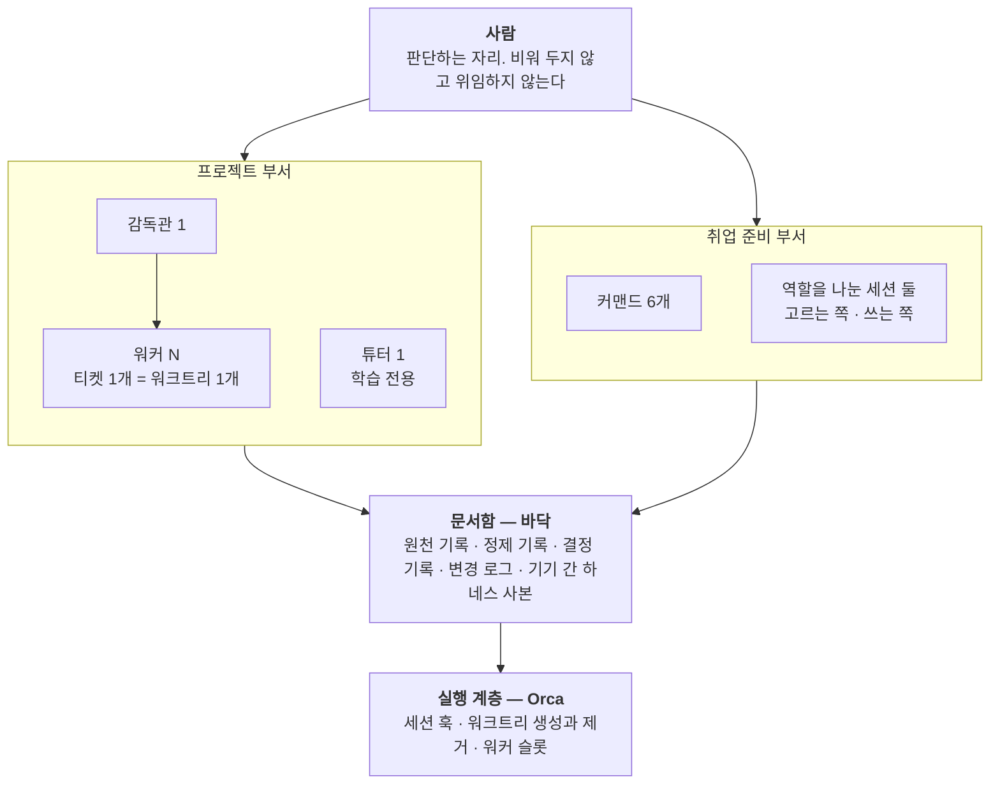

# 에이전트 하네스 — 일은 맡기고, 판단은 남겼다

**코드와 문서와 기록을 AI 에이전트에게 맡기면서, 무엇을 맡기고 무엇을 남길지를 정해 둔 운영 구조입니다.**

2026.07 – · 개인 · PinLog에서 시작해 FINCH와 취업 준비 기록까지 이어졌습니다

---

| 읽는 순서 | |
|---|---|
| 왜 이런 구조가 필요했나 | [어떤 상황이었나](#어떤-상황이었나) · [무엇을 전제하나](#무엇을-전제하나) · [한눈에 보는 구조](#한눈에-보는-구조) |
| 어떻게 바뀌어 왔나 | [세 세대를 한눈에](#세-세대를-한눈에) · [단계마다 걸린 문제가 다음 구조를 만들었다](#단계마다-걸린-문제가-다음-구조를-만들었다) |
| 세대별 기록 | [PinLog](#pinlog-세대에는-규칙을-먼저-적었다) · [FINCH](#finch-세대에는-계층을-셋으로-나눴다) · [취업 준비 기록](#취업-준비-기록에서는-에이전트가-쓸-수-있는-재료를-좁혔다) |
| 무엇이 남았나 | [통제 구조가 실제로 걸러낸 것](#통제-구조가-실제로-걸러낸-것) · [이 구조의 한계](#이-구조의-한계) · [기여의 범위](#기여의-범위) |

---

## 어떤 상황이었나

두 팀 프로젝트에서 프론트엔드 구현을 맡았습니다. PinLog에서는 기능 구현이 사실상 1인이었고, FINCH에서는 구현 전반을 맡았습니다. 두 번 다 코드를 전부 직접 쓰는 선택지는 일정상 없었습니다.

그래서 구현의 상당 부분을 에이전트에게 맡겼는데, 맡기는 쪽에 세 가지 사정이 있었습니다.

- **세션 사이에 대화 맥락이 넘어가지 않습니다.** 파일에 적히지 않은 것은 다음 세션에 존재하지 않습니다. 규칙도, 결정도, 어디까지 했는지도 파일에 있어야 했습니다.
- **에이전트가 팀원에게 직접 닿을 수 있었습니다.** MR·이슈·위키·Jira는 팀 안에서 알림이 가는 글입니다. 제가 내용을 모르는 채로 올라가면 그것을 두고 팀원이 던지는 질문에 제가 답할 수 없습니다.
- **산출 속도가 제 이해 속도를 넘었습니다.** 워커가 하루 열두 건을 처리하는 날이 있었고, 작업 보고에는 제가 모르는 개념이 계속 나왔습니다.

프로젝트가 끝난 뒤 지원서를 쓰는 일에도 같은 에이전트를 쓰게 되면서, 에이전트가 무엇을 재료로 쓸 수 있는지까지 정해야 했습니다. 이 문서는 그 세 시기를 지나며 구조가 어떻게 바뀌었고, 무엇이 아직 풀리지 않았는지를 적은 기록입니다.

---

## 무엇을 전제하나

세대가 바뀌어도 유지된 전제입니다. 아래 구조는 전부 이 다섯 줄에서 나왔습니다.

| 전제 | 뜻 |
|---|---|
| 판단은 사람이 한다 | 무엇을 할지, 어떤 티켓을 열지, 팀에 무엇을 보낼지, 규칙을 고칠지는 에이전트가 정하지 않습니다 |
| 경계는 되돌릴 수 있는지로 긋는다 | 커밋·브랜치 푸시는 워커에게 둡니다. MR·이슈·티켓처럼 **팀원에게 알림이 가는 쓰기**는 사람의 승인 뒤로 뺍니다 |
| 워커 하나 = 워크트리 하나 = 브랜치 하나 | 감독관은 기본 브랜치에 머물고, 워커는 자기 워크트리 밖으로 나가지 않습니다 |
| 개인 실행 방식은 팀 저장소에 커밋하지 않는다 | 감독관 프로토콜·워커 계약·모델 배정은 커밋되지 않는 로컬 파일에 둡니다. 팀 공유 지침과 섞지 않습니다 |
| 기록 저장소가 따로 있다 | 워커의 작업 기록과 기기 간 하네스 사본을 담는 개인 저장소(이하 **볼트**)를 둡니다. 워커는 그곳에 **새 파일만** 쓸 수 있고 읽을 수는 없습니다 |

---

## 한눈에 보는 구조

| 층 | 무엇이 있나 | 무엇을 정하나 |
|---|---|---|
| 사람 | 저 | 무엇을 할지, 어떤 티켓을 열지, 무엇을 밖에 낼지, 규칙을 고칠지 |
| 부서 | 프로젝트 부서와 취업 준비 부서. 둘 다 에이전트가 실행한다 | 정하지 않는다. 받은 일을 한다 |
| 문서함 | 두 부서가 같이 읽고 쓰는 기록 | 규칙이 형식을 정한다 |
| 실행 계층 | 워크트리와 세션을 띄우고 치우는 도구 | 정하지 않는다. 훅을 쥐고 있어도 그건 관측 범위다 |

**문서함은 부서가 아니라 바닥입니다.** 어느 한 부서의 소유가 아니라 두 부서의 에이전트가 같이 씁니다. 실행 계층이 위가 아니라 아래에 있는 것도 같은 이유입니다. 이 조직도는 2026년 9월에 에이전트가 제안했고, 저는 그중 **판단하는 최상단 에이전트를 두지 않는다**를 확정했습니다.

---

## 세 세대를 한눈에

| | PinLog 세대 | FINCH 세대 | 취업 준비 기록 |
|---|---|---|---|
| 시기 | 2026.07–08 · 6인 팀 | 2026.08–09 · 5인 팀 | 2026.08– · 개인 |
| 핵심 | 에이전트가 지킬 **규칙과 관문을 문서로 먼저** 적었다 | 감독관·워커·튜터 **세 계층**으로 나누고, 경계를 **되돌릴 수 있는지**로 그었다 | 에이전트가 쓸 수 있는 **재료를 원자로 한정**하고, 기록을 두 층으로 나눴다 |
| 앞 세대에서 바뀐 것 | 묻고 답을 붙이던 방식에서, 규칙 문서 · 병렬 작업 공간 · 감독 창구 하나로 | 학습 세션을 따로 뺐다. MR 같은 외부 발신을 승인 뒤로 뺐다. 개인 실행 방식을 팀 저장소 밖으로 옮겼다. 사고마다 계약 조항이 붙었다 | 판단이 든 변경은 결정 기록으로 따로 둔다. 설명하지 못하는 원자는 쓰지 않는다. 부르지 않게 된 커맨드는 없앴다 |
| 그 세대에 드러난 한계 | 권한을 실행 주체와 무관하게 고정해 둬서, 모델을 낮추자 지시 밖 수정이 머지·배포됐다. 감독이 기억할 문맥이 길어졌다 | 화면이 실제로 어떻게 보이는지는 저 한 사람만 판단한다. 제약을 많이 걸수록 결과가 닮아 갔다 | 같은 규칙이 여러 문서에 있을 때 개수는 세지만 내용은 대조하지 못한다. 개인 규칙 파일은 어떤 리뷰에도 잡히지 않는다 |
| 도구 | Claude Code → Codex | Claude Code · Codex · Orca | Claude Code · Obsidian · Python |

### 단계마다 걸린 문제가 다음 구조를 만들었다

세 계층이 처음부터 설계된 것은 아닙니다. 한 단계에서 걸린 문제가 다음 단계를 불렀습니다.

| 단계 | 한 일 | 그래서 걸린 것 |
|---|---|---|
| 0 | 하나씩 묻고 답을 그대로 붙였다 | 코드가 왜 도는지 모른 채 결과만 쌓였다. 다루는 단위가 파일 하나였다 |
| 1 | 저장소 전체를 맡기고 스스로 고치게 했다 | 단위는 프로젝트로 넓어졌지만 엉뚱한 것을 덧붙여도 알아채지 못했다. 순차라 느렸다 |
| 2 | 작업 공간을 나눠 여러 대를 동시에 돌렸다 | 충돌은 줄었지만 제 응답을 기다리는 일이 반복됐고, 어디까지 갔는지 저도 헷갈렸고, 같은 기능이 두 번 구현됐다 |
| 3 | 감독 역할을 세워 창구를 하나로 모았다 | **병목은 AI가 아니라 저였습니다.** 대신 감독이 기억할 문맥이 너무 길어졌다 |
| 4 | 학습 세션을 따로 뺐다 | 감독은 작업만, 학습은 개념만 다루게 됐다 |

2단계와 3단계는 PinLog에서, 4단계는 FINCH에서 일어났습니다.

---

## PinLog 세대에는 규칙을 먼저 적었다

> PinLog · 2026.07–08 · 6인 팀 · [프로젝트 기록](pinlog.md)

코드를 전부 직접 쓰는 선택지가 일정상 없었습니다. 그래서 에이전트가 지킬 규칙과, 규칙이 지켜졌는지 확인하는 관문을 먼저 만들었습니다.

| 층위 | 위치 | 역할 |
|---|---|---|
| 도메인 사실 | `docs/reference/` | 추측 대신 근거로 삼는 원본 기획·명세 |
| 금지 규칙 | [`AGENTS.md`](https://github.com/Team-PinLog/front/blob/dev/AGENTS.md) | 실제 실패를 규칙으로 고정 (6항목) |
| 작업 절차 | [`docs/conventions.md`](https://github.com/Team-PinLog/front/blob/dev/docs/conventions.md) §5 | 티켓 → 브랜치 → **커밋 전 보고** → `/pr` → 머지 |
| 자동 검증 | CI | lint · typecheck · build · test 통과해야 이미지 빌드 |
| 재발 방지 | [`docs/troubleshooting/`](https://github.com/Team-PinLog/front/blob/dev/docs/troubleshooting/README.md) | 다음 세션이 먼저 읽는 자산 |

두 가지 원칙을 세웠습니다. **추측 금지** — 문서에 없는 정책이나 엔드포인트는 구현하지 않고, API 계약의 "협의 필요" 항목을 확정된 것처럼 다루지 않는다. **절차 밖 git 조작 금지** — 이슈키 없이 브랜치를 만들지 않고, 검사가 전부 통과해도 커밋 전에 반드시 멈춰 보고한다.

### 규칙은 실패한 뒤에 추가됐다

`AGENTS.md`의 금지 항목은 처음부터 있던 게 아니라 문제가 터질 때마다 붙인 것입니다.

> "프론트는 토큰을 저장하지 않는다"
> → 에이전트가 이를 **"재발급 로직 자체를 만들지 말라"로 읽어** 401 복구가 통째로 빠졌습니다.

규칙 문장을 고치는 대신, 금지 옆에 **허용되는 인접 행위를 같이 적는 형식**으로 바꿨습니다. 재발급은 하되 토큰 값을 읽거나 보관하지 않는다는 두 문장을 한 항목에 붙였습니다. 같은 오독은 다시 나오지 않았습니다.

### 권한을 상수로 뒀던 것이 실수였다

일정이 급해지며 조율 세션의 권한을 계속 넓혔습니다. Opus로 운용하는 동안은 문제가 없었는데, 토큰이 부족해 모델을 낮추자 지시하지 않은 범위까지 수정된 채로 머지·배포됐습니다.

처음에는 "약한 모델에 권한을 너무 줬다"고 정리했는데 정확하지 않았습니다. **결함은 권한이 모델과 무관하게 고정돼 있었다는 점입니다.** 신뢰의 근거가 사라졌는데 신뢰의 결과만 남아 있었던 겁니다. 이후로는 권한을 상수가 아니라 실행 주체에 종속된 값으로 다룹니다.

### 도구를 옮겨도 하네스는 따라왔다

프로젝트 중반에 Codex로 전환했습니다. 다시 쓴 것은 커맨드 정의뿐이었고 규칙과 절차는 문서에 있어서 그대로 이어졌습니다. Codex는 지정한 범위를 잘 지키는 대신 검토·검증 단계가 길고 토큰 소모가 컸습니다.

2단계에서 레인을 나눈 뒤의 일은 PinLog 기록의 [병렬 작업의 실패와 파일 기준 재설계](pinlog.md#병렬-작업의-실패와-파일-기준-재설계)에 있습니다. 레인을 수정할 파일 목록 기준으로 다시 가른 이야기입니다.

---

## FINCH 세대에는 계층을 셋으로 나눴다

> FINCH · 2026.08–09 · 5인 팀 · [프로젝트 기록](finch.md)

| 계층 | 자리 | 맡는 것 |
|---|---|---|
| 감독관 | 기본 브랜치에 상주 | 태스크 분해, 워커 배정, 승인 게이트, 이슈·MR 상태, 팀 커뮤니케이션 |
| 워커 | 티켓마다 워크트리 하나, 브랜치 하나 | 구현. 커밋하고 브랜치를 올리는 데까지. **MR은 만들지 않고 본문 초안만 파일로 남긴다** |
| 튜터 | 학습 전용 워크트리 | 제가 모르는 개념. 산출물은 팀 저장소가 아니라 학습 노트에 쌓인다 |
| 문서 워커 | 감독관과 같은 디렉토리 | 문서 읽기·분석·초안. 코드는 쓰지 않는다 |

튜터를 따로 둔 이유는 둘입니다. 배정·검토·상태 관리가 모인 감독 문맥에 모르는 개념을 묻는 대화까지 섞였고, 감독관이 직접 설명하면 그 설명이 세션과 함께 사라져 노트에 쌓이지 않았습니다. 워커가 다음 작업 진행 여부를 물어올 때, 직전 산출물의 개념을 공부하기 전까지는 승인하지 않았습니다.

### 지침 파일은 소유를 기준으로 나눴다

팀 저장소의 지침 파일에서 에이전트 오케스트레이션 절 31줄을 떼어 커밋되지 않는 로컬 파일로 옮겼습니다. 팀 저장소에는 어떤 에이전트가 작업해도 필요한 것만 두고, 감독 프로토콜·워커 계약·모델 배정은 제 파일에 둡니다. 목적은 팀원의 저장소에 제 실행 방식이 섞이는 것을 막는 데 있었고, 저장소 파일이 짧아진 것은 그 결과였습니다.

반대로 한 세션에서 세 번에 나눠 읽어야 했던 550줄짜리 인수인계 문서는 줄이지 않기로 했습니다. 줄이다가 「뒤집힌 전제」 항목 하나를 떨어뜨리면 다음 세션이 그것을 모르는 채로 틀린 판단을 합니다. 나눠 읽는 비용은 치를 수 있지만 빠뜨린 전제의 비용은 그렇지 않았습니다. 대신 세션 상태는 문서에 적지 않고 스크립트로 그때그때 조회하고, 학습은 튜터 노트에 두어 문서에 더 얹지 않는 쪽으로 다뤘습니다.

---

## 경계는 실력이 아니라 되돌릴 수 있는지로 그었다

에이전트가 잘하는 일과 못 하는 일로 나누지 않았습니다. 저장소 안에서 끝나는 일과 밖으로 나가는 일로 나눴고, 기준은 되돌리기 비용입니다.

| 에이전트에 맡긴 것 | 제 승인 뒤로 뺀 것 |
|---|---|
| 구현, 커밋, 브랜치 푸시 | MR 생성 |
| 워크트리 생성과 정리 | 이슈·위키·Jira에 쓰는 것 전부 |
| 기록 파일을 새로 쓰는 것 | 팀에 보이는 글의 **문구** — 취지만 승인받고 문구를 지어 올리지 않는다 |
| 문서 초안 | 이슈와 MR을 닫는 것 — 이건 제가 직접 한다 |

브랜치 푸시는 되돌릴 수 있지만 팀원에게 간 알림은 되돌릴 수 없습니다. 워커가 승인 없이 팀에 보이는 글을 올린 일이 두 번 있었고, 그 뒤로 워커는 MR을 만들지 않고 **본문 초안만 파일로 남기고** 놓여나게 했습니다. 작업한 워커만 왜 그렇게 고쳤는지 알기 때문에, 초안은 반드시 워커가 씁니다.

같은 원칙을 감독관 쪽에도 세 군데 넣었습니다. 큰 이슈를 태스크로 쪼갤 때는 계획을 먼저 보고하고 착수 승인을 기다립니다. 워커가 끝나면 코드 머지 판단은 제가 diff를 직접 읽고 합니다. 티켓은 제목과 설명 초안을 먼저 받아 승인한 뒤 만듭니다.

---

## 사고가 날 때마다 규칙이 한 줄씩 붙었다

워커 계약은 처음부터 이 모양이 아니었습니다. 조항마다 무엇이 났는지가 함께 적혀 있어서, 조항을 지울 때는 그 사고가 다시 날 수 있는지를 먼저 보게 됩니다. 아래는 지금 계약에 들어 있는 조항과 그 조항이 붙은 계기입니다.

| 조항 | 계기 | 지키지 않으면 |
|---|---|---|
| **워커는 MR을 만들지 않는다.** 커밋하고 브랜치를 푸시한 뒤 보고하는 것까지가 범위다 | 승인 없이 팀에 보이는 글이 두 번 올라갔다 | 제가 모르는 문장이 제 이름으로 팀에 나간다. 올라간 뒤에 되돌리는 쪽이 더 시끄럽다 |
| **워커는 의존성을 설치하지 않는다.** 필요하면 보고하고 그 자리에서 멈춘다 | `node_modules`가 워크트리 사이에 링크로 공유돼 있다 | 한 워커의 설치가 다른 워커를 말없이 깨뜨린다 |
| **새 티켓을 파기 전에 미머지 브랜치의 고유 커밋을 훑는다** | 2026-09-08, 이미 다른 브랜치에서 더 낫게 풀린 문제를 티켓까지 끊어 다시 풀었다 | 같은 문제를 두 번 풀고, 나중에 충돌로 되돌아온다 |
| **한 워크트리에 에이전트는 하나.** 태스크를 새로 붙이기 전에 헌 터미널을 닫는다 | 2026-09-10, 워크트리 하나에 터미널이 셋 살아 있었다 | 지시가 죽은 터미널로 가고, 되돌리기 지시가 도는 워커의 작업을 지운다 |
| **워커의 질문은 주기적으로 확인한다.** 답할 준비가 없으면 "판단해서 진행하고 근거를 적어라"로 지시한다 | 2026-09-10, 워커 둘이 질문을 던지고 20분·30분을 기다리다 실패로 끝났다 | 완료 신호만 기다리면 중간 질문을 놓친다 |
| **출근하면 락파일이 바뀌었는지 먼저 본다** | 2026-09-16, 402커밋 뒤처진 기기에서 `node_modules`가 있다는 이유로 설치를 건너뛰었다 | 워커가 모듈을 못 찾아 멈춘다 |

규칙 문장은 에이전트가 썼습니다. 무엇을 규칙으로 올릴지는 제가 정했습니다. 이 계약과 감독관 프로토콜, 세션 시작·인수인계·기기 이동 커맨드는 다음 프로젝트에 옮겨 쓸 수 있게 템플릿으로 정리해 두었고, 템플릿 저장소는 비공개로 둡니다.

---

## 취업 준비 기록에서는 에이전트가 쓸 수 있는 재료를 좁혔다

> 2026.08– · 개인

경험을 **원자** 단위로 저장하는 저장소를 만들고, 에이전트는 원자만 재료로 쓰게 했습니다. 원자에 없는 경험은 "없다"고 답합니다.

| 필드 | 뜻 |
|---|---|
| `evidence` | 근거. 커밋·PR 해시나 저장소 경로 |
| `검증` | 근거와 본문을 대조했는가. `완료` / `미완료` |
| `defensible` | "제가 했습니다"라고 말할 수 있는가. 에이전트가 설계하고 제가 검토한 것은 `false` |
| `주의` | 밖에서 쓰면 안 되는 표현. 예: "커밋 수를 성과로 쓰지 않는다" |

지금 원자는 74개이고, 그중 23개가 `defensible: false`, 56개가 검증을 마쳤습니다.

### 형식을 다 채워도 쓸 수 없는 원자가 있었다

2026-09-17에 워커 산출물 일곱 건을 원자 후보로 올렸다가 전부 반려했습니다. `defensible: false`까지 형식은 다 맞았는데, 저는 그 내용을 처음 들었습니다.

`defensible: false`는 "제가 설계했다"라고 **쓰는 것**을 막습니다. 면접에서 "그건 어떻게 찾으셨어요?"라고 **묻는 것**은 막지 못합니다. 그래서 **자료를 다시 읽지 않고 꼬리질문에 답할 수 있어야 원자**라는 게이트를 새로 만들었습니다. 판정은 제가 합니다. 같은 기준으로 기존 원자를 다시 보니 여섯 건이 통과하지 못했고, 파일은 남기되 쓰지 않는 것으로 돌렸습니다.

### 기록은 두 층으로 나눴다

| | 원천층 | 정제층 |
|---|---|---|
| 담는 것 | 그날의 결정·막힌 것·배운 것 | 경험 원자, 지원서, 작성 가이드 |
| 우선하는 것 | 즉시성. 검증 전이어도 쓴다 | 정확성. 근거와 검증 상태가 필수 |
| 로그 | 남기지 않는다. 기록마다 로그를 요구하면 기록 자체를 안 하게 된다 | 모든 변경을 남긴다 |

두 층 사이의 통로는 하나입니다. 원천 기록을 자기소개서에 바로 인용하지 않고, 먼저 원자로 옮겨 근거를 붙입니다.

규칙 파일이 층마다 있어서 충돌하면 어느 쪽을 따를지도 정해 뒀습니다.

| 규칙 | 뜻 |
|---|---|
| 범위 우선 | 각 파일은 자기 층만 다스린다 |
| 금지 하향 | 위의 금지는 아래로 상속된다 |
| 완화 불가 | 아래는 위의 금지를 풀 수 없고, 좁히기만 할 수 있다 |

금지는 위가 이기고 절차는 아래가 이깁니다. 층의 차이는 빨리 쓰느냐 엄격히 쓰느냐이지, 무엇을 금지하느냐가 아니기 때문입니다. 금지는 모든 층에서 같은 쪽을 봅니다. **지어내지 않는다.**

**판단이 들어간 변경은 결정 기록으로 따로 둡니다.** 변경 로그는 무엇이 언제 바뀌었는지를, 결정 기록은 왜 그렇게 정했는지와 무엇을 기각했는지를 맡습니다. 둘 다 덧붙이기만 하고 고쳐 쓰지 않습니다. 원자가 결정 기록을 근거로 가리키기 때문에, 고쳐 쓰면 원자의 근거가 흔들립니다.

### 만들어 쓰는 커맨드와 없앤 커맨드

반복되는 일은 커맨드로 만들었습니다. 커맨드마다 절차가 파일 하나에 적혀 있고, 에이전트는 그 절차를 따릅니다.

| 커맨드 | 하는 일 | 절차에서 정해 둔 것 |
|---|---|---|
| `/recruits` | 채용 사이트 네 곳의 새 공고를 스캔해 등급을 매기고 Notion에 등록한다 | 검토한 공고 대장을 파일로 두고, 저장하자마자 커밋·푸시한다. 회차 끝에 몰아서 커밋하던 때는 세션이 끊기면 판정 기록이 사라졌다 — 9월 7일부터 여러 번 돈 스캔 중 커밋된 것이 하나뿐이었다 |
| `/cover` | 자기소개서 문항의 유형을 판별하고 초안을 쓴다 | 세션을 둘로 나눴다. 고르는 쪽은 어느 원자를 쓸지 번호와 경로까지만 정하고, 쓰는 쪽이 원자 파일을 직접 연다. 초안은 17항 자가 점검을 거친다 |
| `/atom` | 자료에서 경험을 원자로 뽑아 저장하고, 마지막에 저장소와 대조한다 | 원천층에서 정제층으로 가는 유일한 통로다. 설명 게이트를 여기서 통과해야 한다 |
| `/submitted` | 제출한 지원을 정리하고, 제출본이 원자와 다르게 말한 곳을 찾아 원자를 고친다. 전형 결과도 여기서 반영한다 | 판단이 서지 않는 차이는 고치지 않고 대기 파일에 쌓아 둔다 |
| `/brief` | 볼트를 읽지 못하는 웹 세션에 붙여 넣을 요약을 만든다 | 볼트가 바뀔 때마다 고치지 않고, 붙여 넣기 직전에 현재 상태로 다시 만든다 |
| `/harvest` | 뉴스 브리핑에 남긴 메모를 원천 기록으로 옮긴다 | 주 1회 제가 부른다. 자동 실행을 걸지 않는다. 메모를 요약하거나 다듬지 않고 쓴 그대로 옮긴다 |

`/cover`를 둘로 나눈 뒤에도 한 번 더 고쳤습니다. 처음에는 고르는 세션이 원자 본문과 금지 표현 목록을 지시서에 옮겨 담아 넘겼는데, 금지를 30개 넘게 받은 쓰는 세션이 그것을 본문 안에서 이행해, 괄호로 부정하는 문장이 늘고 글이 방어적으로 나왔습니다. 그래서 지시서는 원자 번호만 넘기고, 쓰는 세션이 원자 파일을 직접 열어 읽게 했습니다.

프로젝트 쪽 커맨드는 넷입니다. `/start`는 인수인계 문서를 읽고 상태 조회 스크립트를 돌려 지난 세션 이후 바뀐 것과 오늘 할 일을 짧게 보고합니다. `/handoff`는 인수인계 문서를 바뀐 부분만 고치되, 스크립트가 알 수 있는 상태는 담지 않고 **판단과 근거와 방침**만 담습니다. `/출근`과 `/퇴근`은 기기를 옮길 때 하네스를 주고받습니다(아래 「두 기기를 오가며」).

**없앤 커맨드도 있습니다. 틀려서가 아니라 부르지 않게 돼서입니다.** 2026-09-11에 `/audit`(볼트 정합성 점검)과 `/verify`(원자를 저장소와 대조)를 없앴습니다. 사용 이력을 재 보니 `/audit`은 4회(마지막 8월 25일), `/verify`는 10회(마지막 9월 8일)에서 멈춰 있었습니다. 점검 결과를 사람이 직접 처리해야 하는 구조라 손이 가지 않았습니다. 기능은 버리지 않고 이미 부르는 커맨드 끝으로 옮겼습니다.

| 없앤 것 | 기능이 옮겨 간 곳 |
|---|---|
| `/audit` | 기계로 판정되는 항목은 검사 스크립트로 만들어 `/atom`·`/submitted`가 끝날 때마다 자동으로 돈다. 판단이 필요한 항목(자기소개서가 원자와 다르게 말한 곳)은 `/submitted`의 원자 개정 단계가 맡는다 |
| `/verify` | 원자 하나를 저장소와 대조하는 절차는 `/atom`의 마지막 단계가 됐다. 기존 원자를 다시 볼 때는 `/atom`의 재검증 모드를 쓴다 |

부를 때만 돌던 점검이 매번 돌게 됐습니다. 다만 `/audit`의 13항 중 두 항목(수치 충돌, 인용 커버리지)은 아직 어디로도 옮기지 못했습니다. 지운 커맨드 파일은 삭제하지 않고 폐지 폴더에 사유와 함께 남겨 뒀습니다.

---

## 통제 구조가 실제로 걸러낸 것

장치가 있다는 것보다 장치가 무엇을 잡았는지가 근거라고 봅니다.

| 무엇이 걸렸나 | 어떻게 드러났나 | 무엇을 바꿨나 |
|---|---|---|
| 워커 산출물 일곱 건이 원자 후보로 올라왔다 | 형식은 다 맞았지만 제가 내용을 설명하지 못했다 | 설명 게이트를 만들고, 기존 원자 여섯 건을 같은 기준으로 쓰지 않는 것으로 돌렸다 |
| 기록 파일명 규칙 위반이 46건 쌓였다 | 한 달 가까이 지나 한 번에 확인됐다. 워커의 작업 기록이 정해 둔 세 유형 어디에도 맞지 않아 아무 이름이나 붙었다 | 양식을 버리지 않고 유형을 하나 새로 만들었다. 유형이 또 안 맞으면 이름을 흐리지 않고 유형을 새로 제안한다 |
| 개인 규칙 파일이 18일 동안 폐기된 전송 방식을 확정이라고 적고 있었다 | 감독관이 그걸 믿고 저에게 틀린 설명을 했다. 전날에도 같은 원인으로 주문 방식을 틀렸다 | 그 파일의 기술 조건은 팀 문서에서 한 번 확인한 뒤에 쓴다 |
| 요약 문서의 갱신이 사흘치 밀렸다 | 갱신 트리거 셋이 전부 발동했는데 따라가지 못했다 | 트리거를 늘리지 않고, 볼트가 바뀔 때마다 갱신하는 대신 **쓰기 직전에 현재 상태로 다시 만든다**로 바꿨다 |
| 기계 검사가 "미등록 8건"을 계속 띄웠다 | 등록 누락이 아니라 파일명의 유니코드 정규화 방식(NFD/NFC)이 달라 눈으로는 같은 글자가 비교에서 어긋난 것이었다 | 검사를 고치고 볼트 전체 이름을 NFC로 통일했다. 검사가 처음으로 0건이 됐다 |

---

## 두 기기를 오가며 하네스를 옮겼다

팀 프로젝트 코드는 원격 저장소에 있어 기기를 옮겨도 따라옵니다. 그런데 일하는 방식을 정하는 파일 — 감독관과 워커의 계약, 인수인계 문서, 도구 스크립트, 메모리 — 은 전부 팀 저장소에 커밋되지 않는 로컬 파일입니다. 팀원에게 보일 것이 아니기 때문입니다.

그래서 개인 기록 저장소를 정본으로 두고 기기 사이에 복사합니다.

| 명령 | 순서 |
|---|---|
| 퇴근 | 브랜치를 원격에 올린다 → 다 쓴 워크트리를 정리한다 → 인수인계를 갱신한다 → 퇴근 시각을 찍는다 → 하네스를 정본으로 보낸다 |
| 출근 | 하네스를 받는다 → 출근 시각을 찍고 지난 퇴근을 본다 → 기본 브랜치를 맞춘다 → 락파일이 바뀌었으면 의존성을 설치한다 → 떠난 기기가 못 치운 워크트리를 치운다 |

순서에는 이유가 있습니다. 인수인계를 쓰기 전에 하네스를 보내면 낡은 인수인계가 올라갑니다. 출근 시각을 하네스를 받기 전에 찍으면 저쪽 기기의 기록을 덮어쓴 채로 받습니다. **"지난 세션이 퇴근 없이 끝났다"가 뜨면**, 인수인계가 그 세션의 결과를 담고 있지 않다는 뜻이라 크게 알리게 했습니다.

동기화 스크립트는 기본값이 **무엇이 다른지 보고만 하는 것**입니다. 복사 방식이라 보내는 것을 잊으면 변경이 넘어가지 않는데, 기본 동작을 보고로 두면 잊었을 때 눈에 띕니다.

---

## 이 구조의 한계

- **"실제로 어떻게 보이는가"는 저 한 사람만 판단합니다.** 에이전트는 화면을 띄워 볼 수 없습니다. 손익 색, 시세가 없을 때의 헤더, 탭이 차지하는 세로 공간 세 건이 전부 이 자리에서 잡혔습니다. 제가 꼼꼼해서가 아니라 구조가 그 단계를 한 사람에게 남겨 뒀기 때문입니다. 이 판단을 대조표로 덜어 보려던 시도는 표가 화면을 고치는 데까지 이어지지 않아 접었고, 판단은 다시 저에게 돌아왔습니다.
- **제약을 많이 쓸수록 결과가 서로 닮아 갔습니다.** 디자인 시안 셋을 경쟁시키면서 서로 섞이지 않게 제약을 많이 걸었는데, 그 제약이 세 방향을 수렴시켰습니다. 고르라고 만든 선택지가 고를 것이 없는 선택지가 됐습니다.
- **판단을 사람에게 모았으니 사람이 병목입니다.** 감독 창구를 하나로 모아 접점은 줄였지만, 판단 자체는 여전히 저에게 옵니다.
- **같은 규칙이 여러 문서에 있을 때, 개수는 셀 수 있지만 내용은 대조하지 못합니다.** 한 곳만 고치면 태그 수가 안 맞아 걸리지만, 세 곳을 다 다르게 고치면 태그 수는 맞아서 못 잡습니다. 내용 대조는 사람이 합니다.
- **개인 규칙 파일은 어떤 리뷰에도 잡히지 않습니다.** 모든 세션이 가장 먼저 읽는 자리인데 검증 절차가 없습니다. 기기별 경로를 표로 갈라 두고 "스크립트가 푼 값이 표보다 우선"이라고 적었지만, 낡는 구조 자체는 그대로입니다.
- **지금 구성이 최선이라고 말할 근거는 없습니다.** 나눠야 했던 이유가 증상으로 남아 있을 뿐이고, 더 잘게 나누는 안을 검토한 기록은 없습니다. 문맥 길이나 대기 시간을 재 두지 않아 "효율이 올랐다"고도 말할 수 없습니다.

---

## 기여의 범위

| 제가 결정한 것 | 에이전트가 만든 것 |
|---|---|
| 판단하는 자리는 사람이 맡고 위임하지 않는다 | 규칙·지침 문서의 문장 |
| 증상이 나올 때마다 계층을 나눈다 | 각 워커의 구현 코드 |
| 경계를 "되돌릴 수 있는가"로 긋는다 | 동기화·상태 조회·세션 기록 스크립트 |
| 경험을 원자로 저장하고 에이전트가 그것만 재료로 쓰게 한다 | 결정 기록과 변경 로그의 본문 |
| 설명하지 못하는 원자는 쓰지 않는다 — 제가 반려한 것이 계기 | 조직도 제안 |
| 무엇을 규칙으로 올릴지, 무엇을 기각할지 | 계약 조항 초안 |

---

## 숫자

| | 2026-09-30 기준 |
|---|---|
| 경험 원자 | 74 |
| 결정 기록 | 45 |
| 변경 로그 항목 | 388 |
| 원천 기록 | 146 |
| 커맨드 | 6 |
| 자동화 스크립트 | 볼트 15 · 팀 저장소 6 |
| 훅 | 2 |

규모이지 성과가 아닙니다. 기록이 많다는 것은 기록을 했다는 뜻이지 기록이 맞다는 뜻이 아닙니다. 맞는지는 위 「통제 구조가 실제로 걸러낸 것」이 보여 줍니다.

---

## 도구

