# PinLog — 프론트엔드 기능 구현 담당
> 장소 이름이 기억나지 않아도 경험과 감정으로 다시 찾는 AI 장소 기록 서비스입니다.
> 2026.07–08 · 5주 · 6인 (기획 / 프론트엔드 / 백엔드 / 인프라 분리) · SSAFY 프로젝트

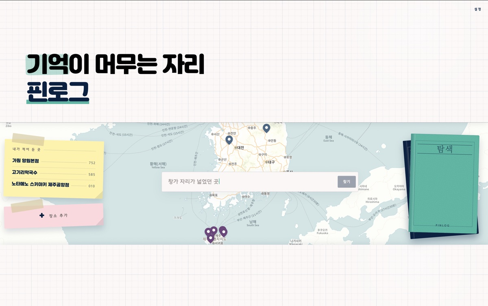

**시연 영상** [전체 흐름](https://youtu.be/lD5MbHL9TZ8) · **저장소** [Team-PinLog/front](https://github.com/Team-PinLog/front) · **팀** [Team-PinLog](https://github.com/Team-PinLog)

> 서비스는 2026.08 배포 종료. 아래 화면은 종료 직전 기록입니다.

---

## 무엇을 만들었나
6인 팀에서 프론트엔드 기능 구현을 맡았습니다. 프론트엔드 저장소 커밋 206건 중 178건을 담당했습니다.

- **자연어 검색** — 저장해둔 맥락을 문장으로 다시 찾는 화면. 서비스의 핵심 기능
- **장소 추가** — 사진에서 장소를 추출하는 경로와 검색으로 찾는 경로 두 가지
- **지도와 레코드** — 마커에서 레코드 상세로 이어지는 흐름
- **피드·라이브러리·컬렉션** — 레코드 저장과 팔로우
- **인증** — 토큰 만료 시 재발급 처리

UI/UX는 동료([@ghkim1632](https://github.com/ghkim1632))가 담당했고 목업을 기준으로 API·라우팅·기능을 구현했습니다. 마감 1.5주 전에 디자인 개편이 결정된 뒤로는 화면 개선에도 직접 참여했고, 마감 3일 전 재개선 때는 인프라 담당자의 도움도 받았습니다.

### 화면

> AI 응답 대기와 타이핑 구간은 배속 처리했습니다.

1. **자연어 검색** — 저장한 맥락을 문장으로 다시 찾습니다
   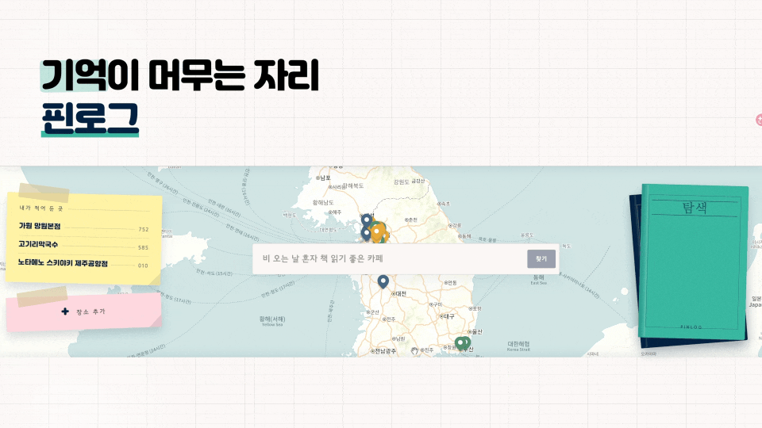
2. **장소 추가 (이미지)** — 사진에서 장소를 추출해 기록
   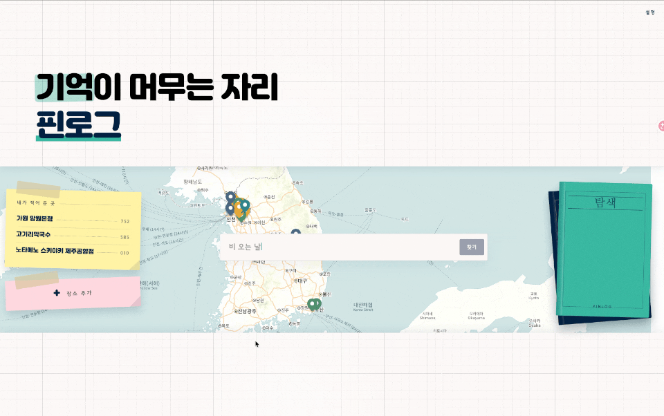
3. **장소 추가 (텍스트)** — 검색으로 장소를 찾아 기록
   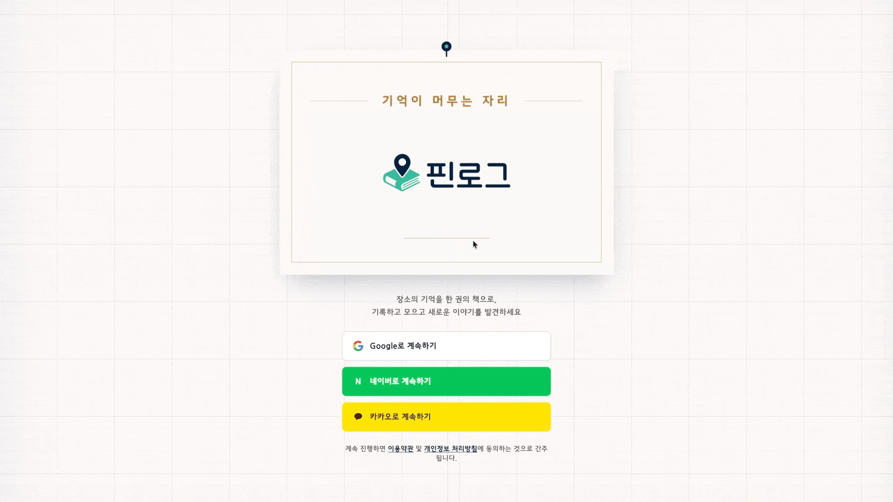
4. **지도 마커 → 레코드 상세**
   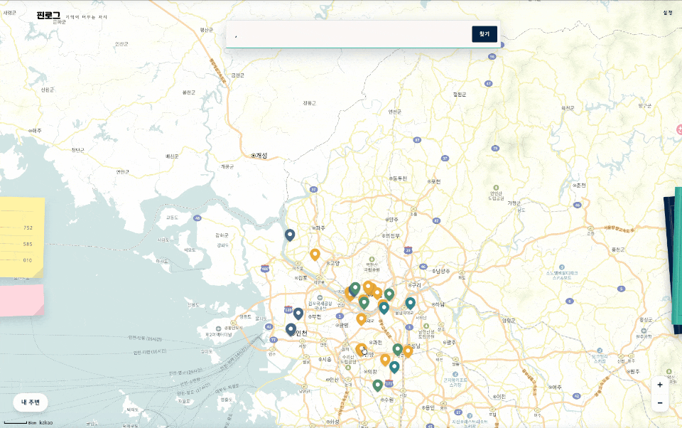
5. **피드** — 레코드 저장과 팔로우
   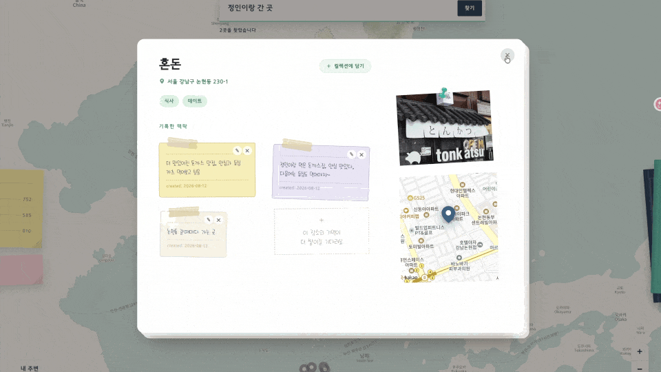
6. **라이브러리**
   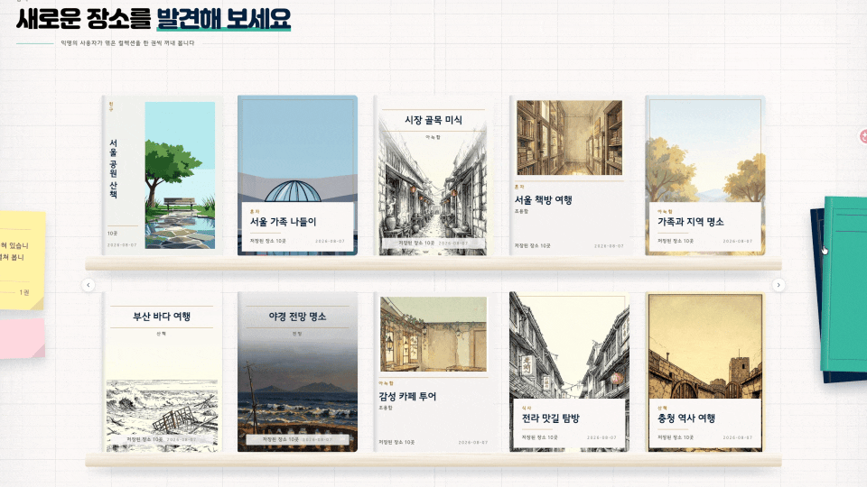

| | | |
|---|---|---|
| 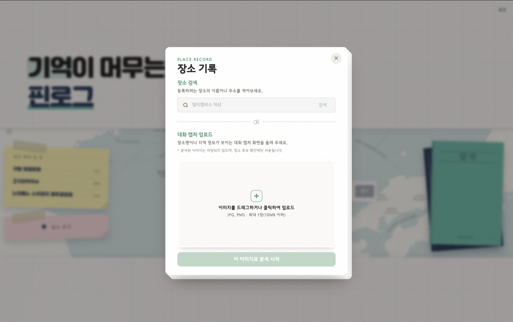 장소 추가 | 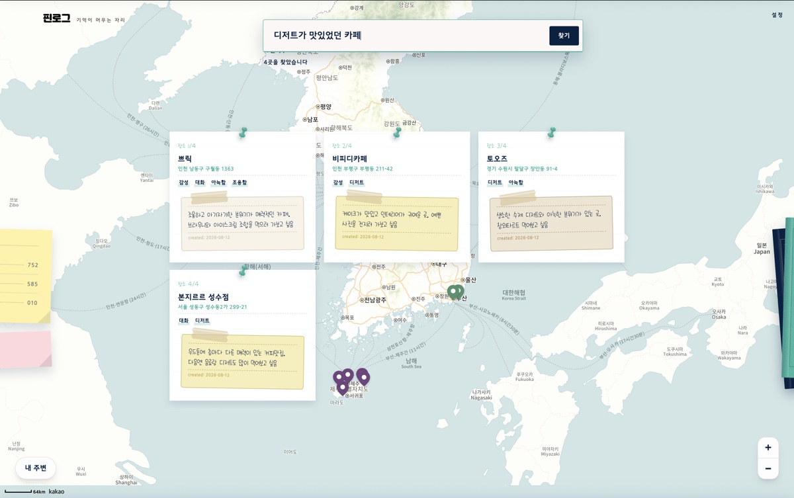 검색 결과 | 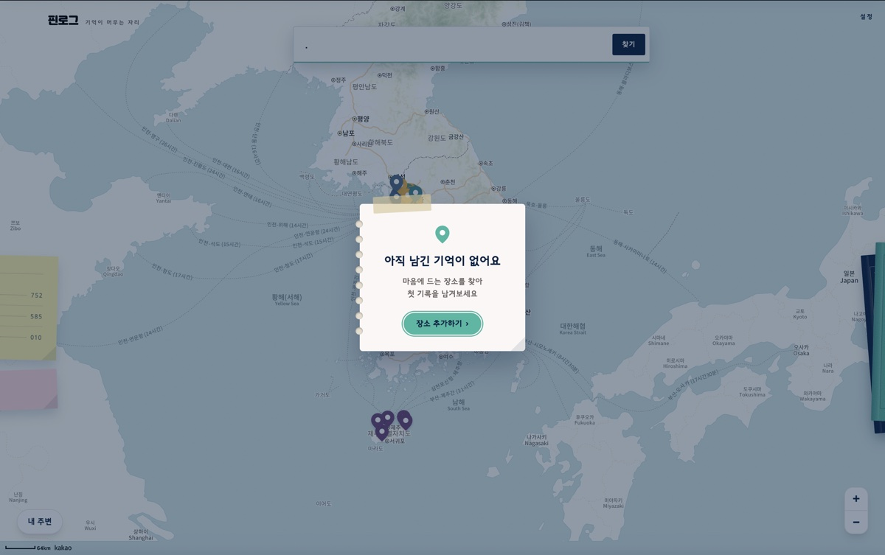 검색 결과 없음 (빈 상태 처리) |
| 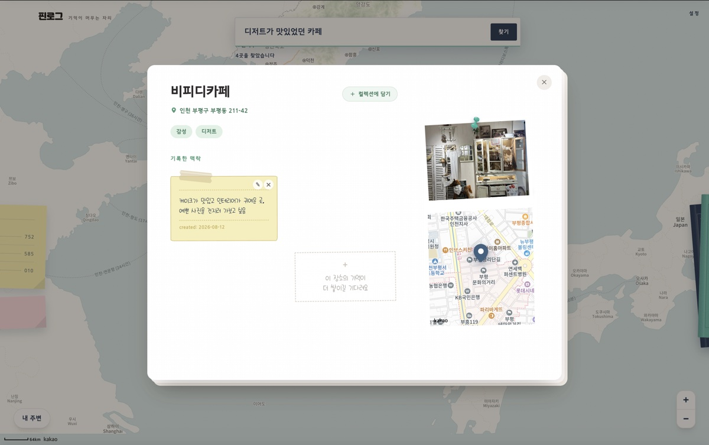 레코드 상세 | 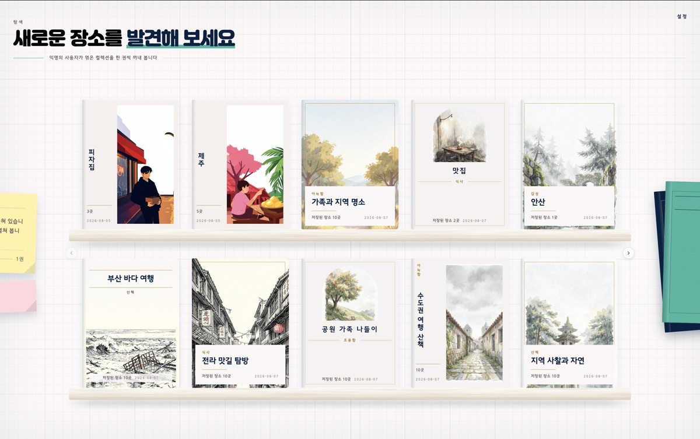 피드 | 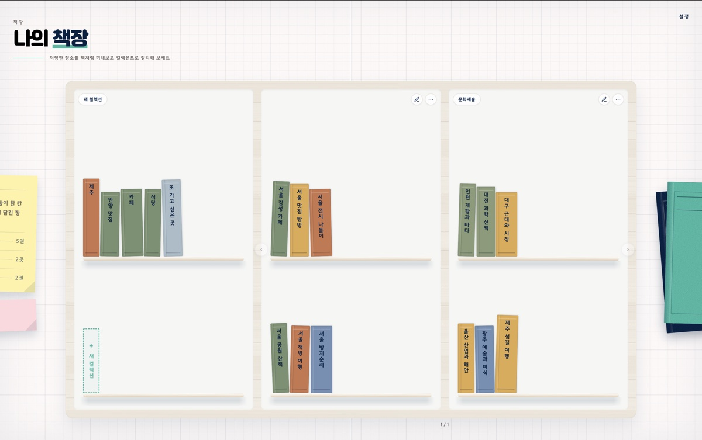 라이브러리 |
| 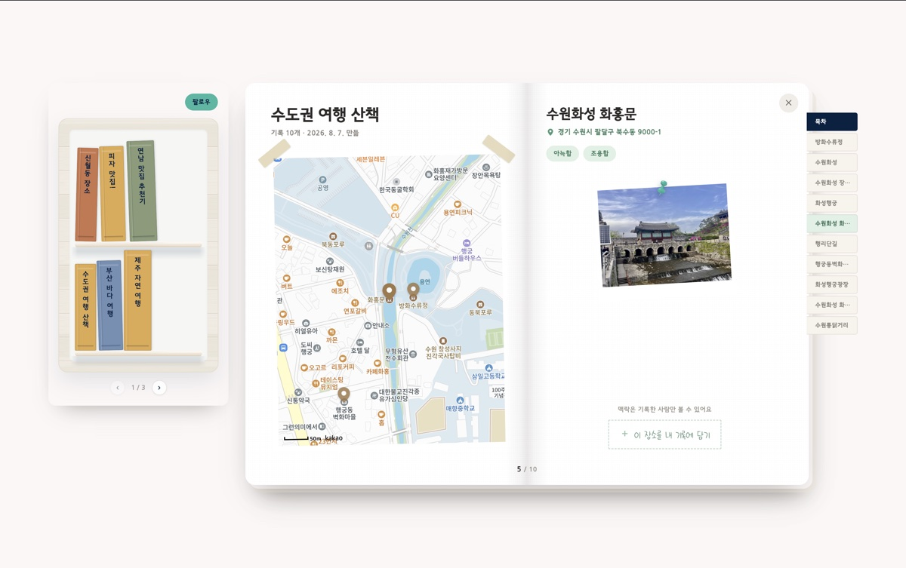 컬렉션 상세 | | |

---

## 구현하면서 부딪힌 것
### 검색 결과 서체의 준비 시점 검증

검색 결과가 표시된 뒤 서체가 바뀌었습니다. 검색창에 포커스가 들어올 때 서체를 미리 받는 개선을 제안하고 수치로 검증했습니다. 서체 내려받기 시작은 페이지 진입 후 913ms에서 149ms로 변경됐습니다. 서체 준비 시점은 검색 결과 렌더 약 11ms 뒤에서 약 806ms 전으로 변경됐습니다.

### 토큰이 만료되면 재발급이 여러 번 나갔다

화면 하나에서 API를 동시에 여러 개 호출하는데, 만료 시점에 그 요청들이 한꺼번에 401을 받으면 재발급도 그만큼 나갔습니다. 진행 중인 재발급이 있으면 뒤따르는 요청이 그 결과를 기다렸다가 재시도하도록 바꿨습니다. 동시 요청 상황을 Vitest 4건으로 확인했습니다.

### 레코드를 만들어도 지도가 그대로였다

생성·삭제 후 지도와 컬렉션 화면이 예전 데이터를 그대로 보여줬습니다. 어떤 요청이 어떤 화면의 캐시를 무효화해야 하는지 mutation 단위로 정리했습니다.

---
## 병렬 작업의 실패와 파일 기준 재설계

직렬로 지시하고 결과를 옮기는 대기를 줄이려고 독립된 작업 폴더를 만드는 `git worktree`로 병렬 작업 레인 3개를 구성했습니다. 레인은 에이전트가 작업을 진행하는 단위입니다.

- **구현 범위 누락** — 레인마다 좁은 범위만 보면서 중복 구현과 연결되지 않은 소비 코드가 발생했습니다.
- **실행 환경 차이** — 병렬 개발 서버 포트가 카카오 콘솔에 등록돼 있지 않아 발생한 SDK 401을 코드 회귀로 오인했습니다.
- **브랜치 이력 변화** — 부모 브랜치의 커밋을 하나로 합쳐 머지하는 squash 처리 뒤, 그 위에 쌓은 브랜치에 충돌이 발생했습니다.

레인을 나누는 기준을 폴더에서 실제로 수정할 파일 목록인 **파일 footprint**로 변경했습니다. 티켓별 대상 파일을 먼저 정하고 파일이 겹치는 티켓은 같은 레인에 순차 배정했습니다. 겹치지 않는 티켓만 병렬 배정하되, 한쪽 작업이 다른 쪽의 임계값에 영향을 주면 실행 순서를 고정했습니다.

PR #125·#126·#127의 파일 목록을 대조해 교집합이 0임을 확인했습니다.

**본인 회고** — 병렬 작업의 결과를 검토하는 일이 다음 작업의 대기로 이어졌다는 판단입니다. 한 레인을 검토하는 동안 다른 레인은 대기했고 레인마다 개발 서버를 따로 띄워야 했습니다.

실패 사례는 `docs/troubleshooting/`에 기록했습니다. 2026-08-07 기준 15건입니다.

관련 기록: [병렬 작업 환경](https://github.com/Team-PinLog/front/blob/dev/docs/troubleshooting/2026-08-06-parallel-worktree-sessions.md) · [카카오 SDK 401](https://github.com/Team-PinLog/front/blob/dev/docs/troubleshooting/2026-08-07-kakao-sdk-401-on-parallel-dev-ports.md) · [squash 머지 후 브랜치 충돌](https://github.com/Team-PinLog/front/blob/dev/docs/troubleshooting/2026-08-07-squash-merge-stacked-branch-rebase.md)

---

## 규칙을 먼저 적어두고 시작했다

코드를 전부 직접 쓰는 선택지가 일정상 없었습니다. 그래서 에이전트가 지킬 규칙과, 규칙이 지켜졌는지 확인하는 관문을 먼저 만들었습니다.

| 층위 | 위치 | 역할 |
|---|---|---|
| 도메인 사실 | `docs/reference/` | 추측 대신 근거로 삼는 원본 기획·명세 |
| 금지 규칙 | [`AGENTS.md`](https://github.com/Team-PinLog/front/blob/dev/AGENTS.md) | 실제 실패를 규칙으로 고정 (6항목) |
| 작업 절차 | [`docs/conventions.md`](https://github.com/Team-PinLog/front/blob/dev/docs/conventions.md) §5 | 티켓 → 브랜치 → **커밋 전 보고** → `/pr` → 머지 |
| 자동 검증 | CI | lint · typecheck · build · test 통과해야 이미지 빌드 |
| 재발 방지 | [`docs/troubleshooting/`](https://github.com/Team-PinLog/front/blob/dev/docs/troubleshooting/README.md) | 다음 세션이 먼저 읽는 자산 |

두 가지 원칙을 세웠습니다. **추측 금지** — 문서에 없는 정책이나 엔드포인트는 구현하지 않고, API 계약의 "협의 필요" 항목을 확정된 것처럼 다루지 않는다. **절차 밖 git 조작 금지** — 이슈키 없이 브랜치를 만들지 않고, 검사가 전부 통과해도 커밋 전에 반드시 멈춰 보고한다.

### 규칙은 실패한 뒤에 추가됐다

`AGENTS.md`의 금지 항목은 처음부터 있던 게 아니라 문제가 터질 때마다 붙인 것입니다.

> "프론트는 토큰을 저장하지 않는다"
> → 에이전트가 이를 **"재발급 로직 자체를 만들지 말라"로 읽어** 401 복구가 통째로 빠졌습니다.

규칙 문장을 고치는 대신, 금지 옆에 **허용되는 인접 행위를 같이 적는 형식**으로 바꿨습니다. 재발급은 하되 토큰 값을 읽거나 보관하지 않는다는 두 문장을 한 항목에 붙였습니다. 같은 오독은 다시 나오지 않았습니다.

### 권한을 상수로 뒀던 것이 실수였다

일정이 급해지며 조율 세션의 권한을 계속 넓혔습니다. Opus로 운용하는 동안은 문제가 없었는데, 토큰이 부족해 모델을 낮추자 지시하지 않은 범위까지 수정된 채로 머지·배포됐습니다.

처음에는 "약한 모델에 권한을 너무 줬다"고 정리했는데 정확하지 않았습니다. **결함은 권한이 모델과 무관하게 고정돼 있었다는 점입니다.** 신뢰의 근거가 사라졌는데 신뢰의 결과만 남아 있었던 겁니다. 이후로는 권한을 상수가 아니라 실행 주체에 종속된 값으로 다룹니다.

### 도구를 옮겨도 하네스는 따라왔다

프로젝트 중반에 Codex로 전환했습니다. 다시 쓴 것은 커맨드 정의뿐이었고 규칙과 절차는 문서에 있어서 그대로 이어졌습니다. Codex는 지정한 범위를 잘 지키는 대신 검토·검증 단계가 길고 토큰 소모가 컸습니다.

---

## 기여의 범위

저장소 커밋 대부분이 제 작업이지만, **코드의 상당 부분은 제가 직접 타이핑한 것이 아니라 에이전트가 생성한 것**입니다.

| 제가 결정한 것 | 에이전트가 생성한 것 |
|---|---|
| 규칙과 절차를 먼저 적고 착수한다 | 규칙 문서의 문장 |
| 레인을 수정할 파일 목록 기준으로 가른다 | 각 레인의 구현 코드 |
| 커밋 전 보고를 관문으로 둔다 | 재발급·상태 관리 구현 |
| 무엇을 기록할지, 언제 멈출지 | 트러블슈팅 문서 본문 |

초반에는 에이전트가 구조까지 잡아준 탓에 코드를 이해하는 속도가 산출물이 나오는 속도를 못 따라갔습니다. 후반에 구조를 따로 읽어 격차를 좁혔고, 다음에는 생성된 코드를 그 자리에서 읽는 것을 절차에 넣으려고 합니다.

---

## 남겨둔 것

- **반응형** — PC 기준으로만 확인했습니다
- **폰트 서브셋** — WOFF2 파이프라인을 만들려다 [라이선스 문제](https://github.com/Team-PinLog/front/blob/dev/docs/troubleshooting/2026-08-07-free-font-license-blocks-subset-pipeline.md)로 멈췄고 대체안을 넣을 시간이 없었습니다
- **AI 응답 대기** — 자연어 검색과 사진 기반 장소 추출은 응답에 몇 초가 걸립니다. 스피너 말고 다른 방법은 손대지 못했습니다

셋 다 알고 있었지만 순서에서 뒤로 밀었습니다.

---

## 기술 스택

React 19 · TypeScript · Vite · TanStack Router/Query · Tailwind CSS · Axios · Zod · React Hook Form · Vitest
Nginx 정적 이미지 · Kubernetes 배포 (Infra 저장소 GitOps 경계)
구조와 데이터 흐름은 [`docs/architecture.md`](https://github.com/Team-PinLog/front/blob/dev/docs/architecture.md)에 있습니다. 트러블슈팅 기록은 2026-08-07 기준 15건이며, [`docs/troubleshooting/`](https://github.com/Team-PinLog/front/blob/dev/docs/troubleshooting/README.md)에 있습니다.

---

정리 이전 판은 [`_archive/2026-08-17_pinlog_검증전원본.md`](_archive/2026-08-17_pinlog_검증전원본.md)에 보관돼 있습니다. 무엇을 왜 뺐는지는 [`_archive/README.md`](_archive/README.md) 참조.
